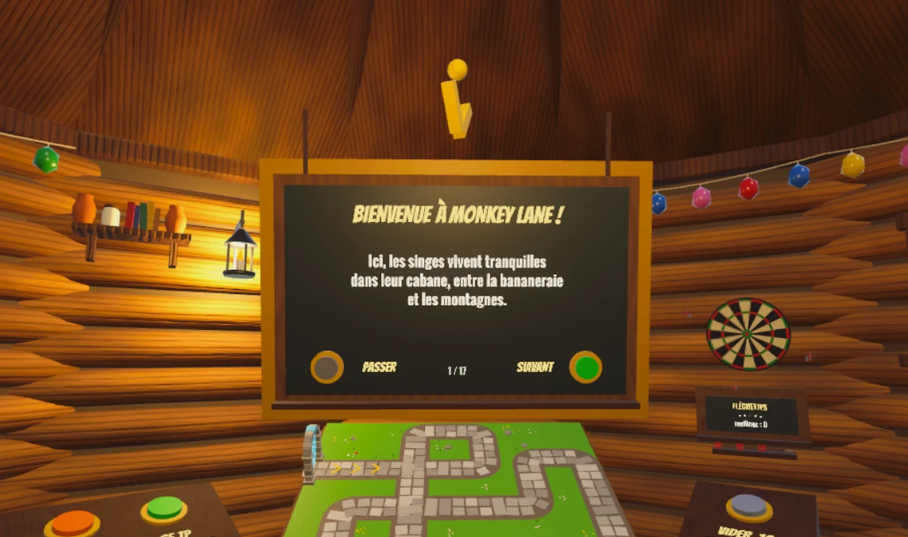

# Bloons VR — SAÉ 5D.01 · Jeu VR

> **Pitch :** un tower defense en VR dans l'univers de Bloons TD : tu es Quincy, tu tires à l'arc sur les ballons, tu poses tes singes à la main sur une maquette, et tu fais tourner ta bananeraie pour payer le tout.

BUT MMI 3, IUT de Béziers. Jeu en réalité virtuelle réalisé sous Unity (C#) pour casque Meta Quest. Rendu et oral le vendredi 13 novembre 2026.



**Documents :** [GDD](docs/GDD.md) ([version Word](docs/GDD.docx)) · [tableau de suivi GitHub](https://github.com/users/dyzlek/projects/2) · [organisation](docs/ORGANISATION.md) · [guide du code](docs/GUIDE_CODE.md)

## Équipe

| Membre | Rôle | Ce qu'il a produit |
|---|---|---|
| **Dylan** | Hub, carte et singes · intégration · dépôt Git et suivi | Cabane et carte (modèles Blender générés par script), bibliothèque, maquette en direct, pose et fusion des singes, animations des singes, 100 vagues, tutoriel intégré, fusion des branches |
| **Maxens** | Économie : la bananeraie | Bananiers, bananes qui pourrissent, panier, comptoir d'améliorations, singes récolteurs |
| **Nicolas** | Coffre, arc et casino | Coffre et raretés (roulette d'ouverture, probabilités), améliorations de l'arc de Quincy, roulette de casino |

Encadrement : Antoine Chollet (game design), Davide Di Pierro (technique), Nicolas Maurin (gestion de projet), Ilyasse Lojdi (3D et optimisation).

## Le jeu
- **Le hub (la cabane) :**
  - on prend ses singes dans une bibliothèque (7 types × 8 raretés) ;
  - on les pose sur une maquette de la carte qui montre la vague en direct ;
  - on fusionne deux singes identiques en un singe plus rare ;
  - on ouvre le coffre pour gagner des singes, et on joue aux fléchettes.
- **La bananeraie, derrière la porte :**
  - on attrape les bananes et on les lance dans le panier avant qu'elles ne pourrissent ;
  - on améliore les bananiers et on achète des singes récolteurs ;
  - on mise à la roulette.
- **La carte, à taille réelle :**
  - on défend le chemin à l'arc ;
  - on améliore l'arc (perforante, transperçante, tir triple, explosion).
- **100 vagues progressives :** rapides, blindés, cœurs, boss, puis des dirigeables rouges aux vagues 25, 50, 75 et 100. La vague 100 donne la victoire, et le mode infini continue ensuite.
- **Tutoriel intégré** en 17 étapes, sur des tableaux du décor, avec une flèche dorée. Il comprend la vague 1 à l'arc seul, puis le premier singe offert. On peut le PASSER après confirmation.
- **Confort :**
  - téléportation et snap turn, voile noir à chaque téléportation ;
  - tout le texte est écrit dans le décor ;
  - tout est à portée de bras.

## État du projet : ven. 9 oct. 2026 (fin de la semaine 1)
- **Dans `main` :** tout ce qui est décrit ci-dessus, sauf le GDD complet et la confirmation de PASSER (PR [#124](https://github.com/dyzlek/SAE501/pull/124) et [#126](https://github.com/dyzlek/SAE501/pull/126) à relire).
- **À tester au casque :** le tutoriel, les 100 vagues, la porte, la roulette, après avoir régénéré les scènes.
- **Priorités de la semaine 2 :**
  - sons et vibrations à chaque action ([#34](https://github.com/dyzlek/SAE501/issues/34)) ;
  - partie complète avec victoire / défaite / rejouer ([#31](https://github.com/dyzlek/SAE501/issues/31)) ;
  - 72 fps sur le Quest ([#35](https://github.com/dyzlek/SAE501/issues/35)) ;
  - test par un autre groupe le 23 oct. ([#36](https://github.com/dyzlek/SAE501/issues/36)).

Journaux : [général](docs/journal/GENERAL.md) · [Dylan](docs/journal/dylan.md) · [Maxens](docs/journal/maxens.md) · [Nicolas](docs/journal/nicolas.md)

## Lancer le projet
1. Installer Git LFS (une seule fois), puis cloner le dépôt :
```bash
git lfs install
```
2. Unity Hub → *Add* → dossier `Unity/` (version **Unity 6000.6**).
3. **Générer les scènes :** menu **SAE > Générer le prototype**. Les scènes Hub et Labyrinthe sont construites par code ; il faut les régénérer après chaque `git pull` qui touche aux scripts ou aux modèles.
4. Choisir le mode avec **SAE > Mode de jeu** (VR ou PC), ouvrir `Assets/_Project/Scenes/Hub.unity` (on lance **toujours depuis le Hub**), puis Play.
5. **Tutoriel :** il se lance au démarrage, **sauf si SAE > Bac à sable est coché**. Ce mode de développement débloque tout et saute le tutoriel.

**Mode PC (sans casque) :**
- ZQSD pour marcher, la souris pour regarder ;
- clic pour appuyer, prendre et lâcher ;
- A pour la fiche d'un singe, Échap pour libérer la souris.

## Build casque et diffusion
- **Build :** profil Android / Meta Quest, casque en mode développeur, avec le débogage USB autorisé.
- **Voir l'écran du casque, jeu compilé :** rien à changer dans le jeu. Trois possibilités :
  - la diffusion Meta vers [oculus.com/casting](https://www.oculus.com/casting) (même Wi-Fi) ;
  - l'option *Cast device* de Meta Quest Developer Hub (USB) ;
  - `scrcpy`.

  On capture ensuite l'image dans OBS pour la démo à plat.

## Structure
```
Unity/     le projet Unity unique (Unity 6000.6, URP)
  Assets/_Project/Scripts/
    Core/      données et état du jeu (singes, économie, carte, niveaux)
    Hub/       cabane et bananeraie (bibliothèque, plateau, coffre, porte, récolteurs, fléchettes)
    Map/       carte (ballons, vagues, singes posés, décor, portails)
    Player/    joueur VR et PC (téléportation, mains, rayon, appui sur les boutons)
    Weapon/    arc de Quincy et ses améliorations
    Casino/    roulette
    Tutorial/  tutoriel (étapes, tableaux, flèche)
    Runtime/   bananier, bananes (Maxens), coffre (Nicolas) : code d'origine des prototypes
    Editor/    PrototypeGenerator (construit les scènes), outils
  Assets/_Project/Scenes/    Hub.unity (scène de départ) · Labyrinthe.unity (carte)
Blender/   cabane.py, coffre.py : modèles 3D générés par script, exportés en .glb
docs/      GDD.md / GDD.docx (md2docx.py) · captures/ · journal/ (général + un par personne, usage de l'IA)
prompts/   les demandes faites à l'IA par chacun, reformulées et corrigées
```

## Règles d'équipe
- `main` reste toujours jouable. Une branche courte par tâche, une Pull Request relue avant le merge.
- Les scènes sont générées par code : on modifie le générateur ou les prefabs, pas la scène à la main.
- Une issue par tâche sur le [tableau GitHub](https://github.com/users/dyzlek/projects/2) (À faire → En cours → En relecture → Fait).
- Un test sous casque par jour, un build casque chaque vendredi.
- Tout usage de l'IA est noté dans son journal perso ([docs/journal/](docs/journal/GENERAL.md)), et les prompts dans [prompts/](prompts/).

## Workflow Git
```bash
git switch main && git pull
git switch -c feat/mon-sujet      # une branche par tâche
# ... travail, petits commits ...
git push -u origin feat/mon-sujet # puis Pull Request vers main sur GitHub
```
