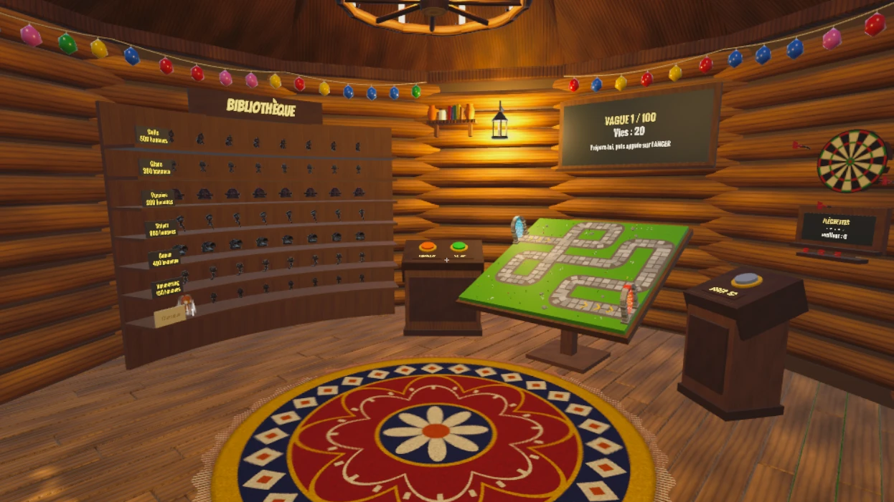
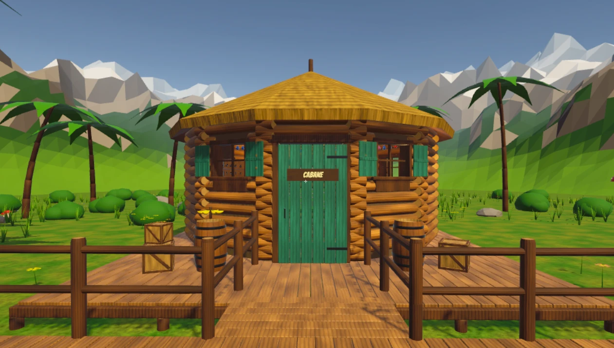
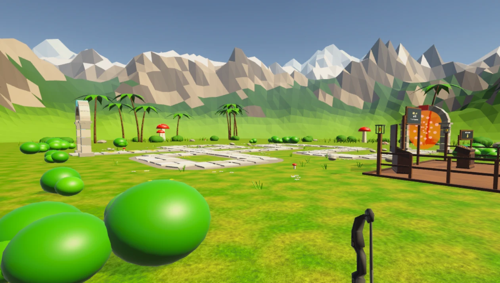
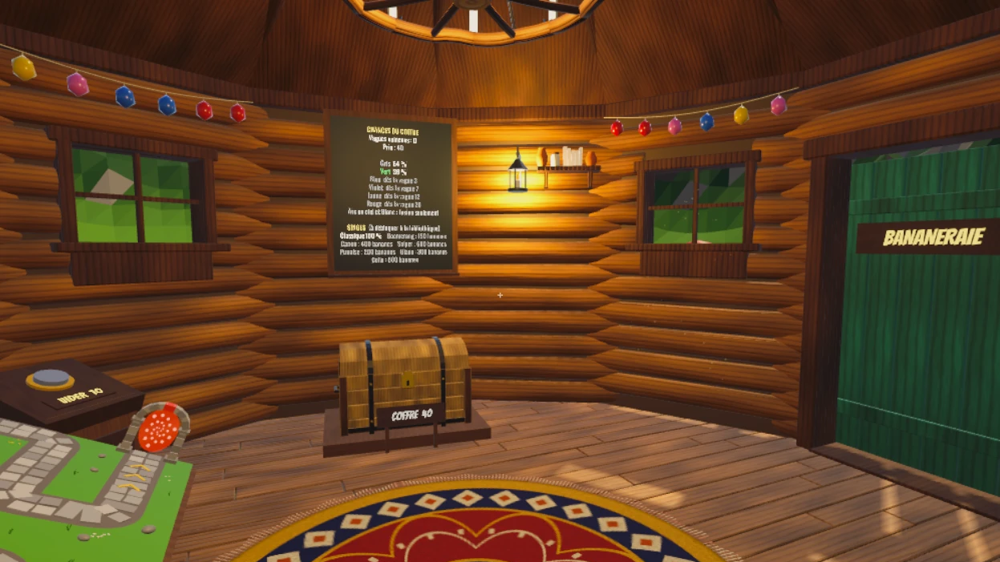
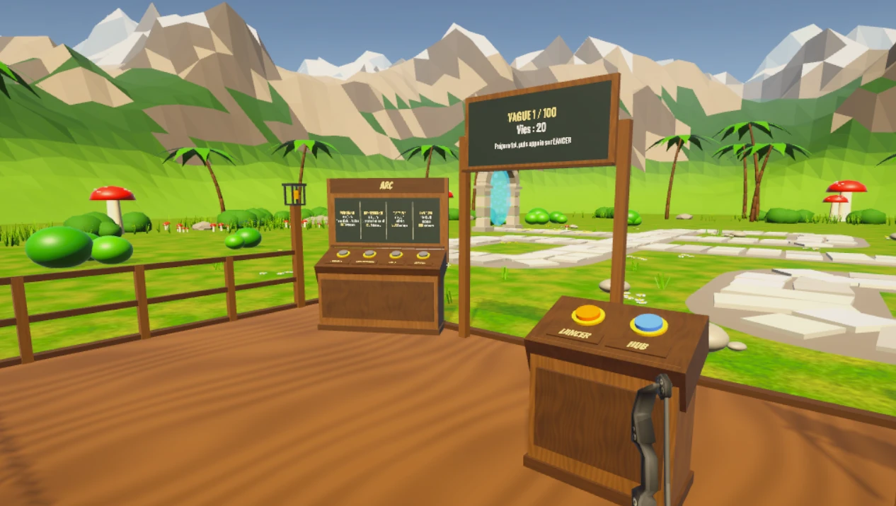
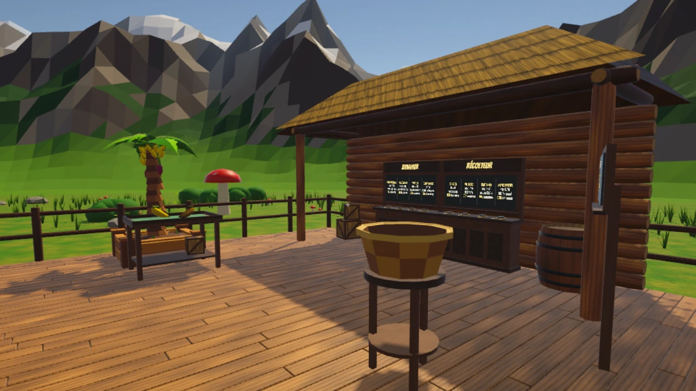
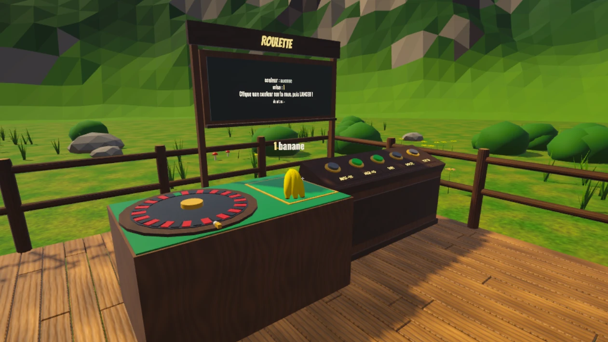

# Bloons VR — Game Design Document

_Un tower defense en réalité virtuelle · Dylan, Maxens et Nicolas · BUT MMI 3, IUT de Béziers (SAÉ 5D.01)_

## 1. Fiche d'identité

| Élément | Détail |
|---|---|
| **Titre de travail** | Bloons VR (fan-game d'école, à renommer pour une diffusion) |
| **Genre** | Tower defense + tir à l'arc + gestion légère |
| **Support** | Casque VR autonome (Meta Quest), debout, espace de jeu de 2 × 2 m minimum ; mode PC clavier-souris pour le développement |
| **Joueurs** | 1 |
| **Public** | Joueurs occasionnels dès 10 ans, découvreurs de la VR, fans de Bloons TD |
| **Durée d'une session** | 2 min de tutoriel, puis des parties de 10 à 30 min (une vague dure 30 s à 2 min) |
| **Ton** | Cartoon, coloré, chaleureux, jamais violent (on éclate des ballons) |
| **Moteur** | Unity 6000.6, XR Interaction Toolkit 3.6, OpenXR |

## 2. Pitch
**En une phrase :** un tower defense en VR dans l'univers de Bloons TD : tu es Quincy, tu tires à l'arc sur les ballons, tu poses tes singes à la main sur une maquette, et tu fais tourner ta bananeraie pour payer le tout.

**En un paragraphe :** des vagues de ballons suivent un chemin de dalles vers la cabane des singes. Le joueur passe sans cesse entre deux échelles :
- **géant dans la cabane**, penché sur une maquette vivante de la carte, il prend ses singes dans une bibliothèque, les pose et les fusionne ;
- **à taille réelle sur la carte**, l'arc en main, il défend lui-même le chemin.

Entre deux vagues, il passe la porte de la cabane pour récolter ses bananes avant qu'elles ne pourrissent : elles paient les coffres, les nouveaux singes et les améliorations. L'objectif : tenir 100 vagues jusqu'aux dirigeables rouges, puis aller le plus loin possible en mode infini.

## 3. Le geste et la boucle

### 3.1 Le geste central
**Tirer à l'arc.** L'arc est dans la main gauche. La main droite vient chercher la corde, serre le grip, recule pour tendre, vise et lâche. C'est le geste VR du jeu : impossible à faire aussi bien à la souris.

**Les gestes secondaires :**
- **saisir et poser** un singe sur la maquette (grip, rayon de pose) ;
- **attraper et lancer** une banane dans le panier ;
- **enfoncer** de gros boutons ronds et **pousser** une porte ;
- **lancer** des fléchettes sur une cible (bonus).

### 3.2 La boucle de 30 secondes
> Le joueur **tire à l'arc et place ses singes** pour **arrêter la vague de ballons**, mais **les ballons arrivent plus nombreux et plus solides, et les bananes pourrissent si on ne les ramasse pas**, et il gagne **des bananes, qui achètent des singes, des coffres et des améliorations**.

### 3.3 Les trois boucles imbriquées

| Échelle | Durée | Le joueur… | Il obtient… |
|---|---|---|---|
| **Micro** | 2 à 5 s | bande l'arc, vise, éclate un ballon ; lance une banane | un ballon de moins, une banane vendue |
| **Vague** | 30 s à 2 min | prépare (pose, fusionne, achète), lance la vague, défend | 20 + 10 × n° de vague bananes |
| **Partie** | 10 à 30 min et plus | débloque des types, fusionne vers les raretés hautes, améliore l'arc et la bananeraie | atteindre la vague 100, puis le mode infini |

## 4. Univers et direction artistique

### 4.1 Univers
L'univers de Bloons TD est assumé : des singes, des ballons colorés, un chemin qui serpente. Le joueur incarne **Quincy**, l'archer de la cabane. Il n'y a pas de scénario à embranchements : l'histoire tient en trois tableaux au début du tutoriel (« Bienvenue à Monkey Lane », « Alerte aux Bloons », « Toi, c'est Quincy »).

### 4.2 Les trois lieux

| Lieu | Ce qu'on y voit | Ce qu'on y fait |
|---|---|---|
| **La cabane (hub)** | Cabane ronde en rondins, toit de chaume, lustre en roue de charrette, lanternes, guirlande de ballons, tapis rond à motifs | Poser et fusionner les singes sur la maquette, ouvrir le coffre, lancer les vagues, jouer aux fléchettes |
| **La bananeraie** | Derrière la grande porte : terrasse en planches fermée par une barrière, allée, abri en rondins, 1 à 3 bananiers, panier sur tabouret, roulette | Récolter les bananes, améliorer les arbres, acheter des récolteurs, miser à la roulette |
| **La carte** | Prairie façon Monkey Lane : chemin de dalles qui se croise deux fois, fleurs, champignons, buissons, palmiers, montagnes low-poly, deux portails en pierre | Défendre à l'arc depuis une estrade en bois, améliorer l'arc |

### 4.3 Direction artistique
- **Style :** low-poly coloré et lisible, sans textures réalistes, des formes rondes et des couleurs saturées. Tout est fait maison par scripts Blender (`Blender/cabane.py`, `coffre.py`) : aucun asset téléchargé.
- **Palette :** bois chaud (cabane, estrade), vert prairie, gris pierre (chemin, portails), or pour l'interface (titres, cadres, flèche du tutoriel), ardoise vert-noir et craie pour les textes.
- **Typographie :** **Bangers** pour les titres (esprit BD), **Oswald Bold** pour les textes. Tout texte est écrit sur un objet du décor.
- **Lumière :** soleil de fin d'après-midi, poussières dorées dans les rayons des fenêtres, flammes qui vacillent dans les lanternes.
- **Codes couleur :**
  - les ballons changent de couleur à chaque couche perdue ;
  - les raretés vont du gris au blanc (gris, vert, bleu, violet, jaune, rouge, arc-en-ciel animé, blanc) ;
  - rouge = interdit, vert = possible, or = action proposée.

### 4.4 Droits
L'univers appartient à Ninja Kiwi. Le projet reste un exercice d'école et un fan-game non commercial, sans logo ni asset officiel. Une candidature aux **Pégases** (catégorie Meilleur jeu étudiant) demanderait de renommer le jeu et de changer l'habillage (singes, ballons, nom), ce qui reste possible : toute la mécanique est indépendante de la marque.

## 5. Type de jeu et références
**« C'est Bloons TD, mais avec ton arc en main et tes singes posés à la main sur une maquette. »**

| Référence | Ce qu'on lui emprunte |
|---|---|
| **Bloons TD 6** | Les codes du tower defense, les types de ballons (couches, rapides, blindés, dirigeables), la carte Monkey Lane |
| **Rush Royale** | La fusion de deux unités identiques, le coffre et ses raretés |
| **Job Simulator** | Saisir, lancer, enfoncer des boutons : tout est physique |
| **In Death, The Lab (Longbow)** | La sensation du tir à l'arc en VR |
| **How to Fish** | La mise posée sur la table, visible (roulette) |
| **Moss** | Le joueur géant penché sur un monde miniature (la maquette) |

## 6. Contrôles

| Action | Casque (Meta Quest) | Mode PC |
|---|---|---|
| Se déplacer | Téléportation : stick vers l'avant, viser, relâcher | ZQSD |
| Tourner | Snap turn de 45° (stick gauche / droite) | Souris |
| Prendre un singe, une banane | Viser (rayon) ou toucher, puis serrer le grip | Clic maintenu |
| Poser / lancer | Relâcher le grip (le rayon de pose montre où) | Relâcher le clic |
| Appuyer sur un bouton | Le toucher du bout de la manette, ou le viser et appuyer sur la gâchette | Clic |
| Tirer à l'arc | Main droite sur la corde, grip, reculer, lâcher | Clic droit maintenu, puis relâcher |
| Fiche d'un singe | Bouton A en visant le singe | Touche A |
| Ouvrir une porte | La pousser de la main, ou la viser et appuyer | Clic |

## 7. Mécaniques et règles

### 7.1 Les deux temps
- **Préparation (au hub) :** rien n'attaque. On gère les singes, les bananes, le coffre, puis on appuie sur **LANCER**.
- **Attaque :** la vague suit son chemin. On peut rester au hub (la maquette montre la carte en direct, ballons compris) ou aller sur la carte avec **SE TP** pour tirer à l'arc. Le monde qu'on quitte continue de tourner : les bananes tombent pendant qu'on défend.

### 7.2 Les singes
On les prend dans la **bibliothèque**, un meuble courbe avec une ligne par type et une colonne par rareté. On les pose sur la maquette avec un rayon de pose : le fantôme est vert si c'est possible, rouge sinon, et un cercle montre la portée.

**Règles de pose :**
- jamais sur le chemin ;
- à 0,95 m au moins d'un autre singe ;
- deux singes côte à côte dans les boucles.

On peut reprendre un singe posé. **VIDER** (10 bananes) range tout le plateau.

| Type | Effet | Portée | Tir toutes les… | Perce | Cibles | Déblocage |
|---|---|---|---|---|---|---|
| **Classique** | Tire sur le ballon le plus avancé | 6 m | 1 s | 1 | 1 | offert |
| **Boomerang** | Touche 2 ballons par lancer | 6 m | 1 s | 1 | 2 | 150 |
| **Punaise** | Touche 4 ballons proches | 4 m | 0,7 s | 1 | 4 | 200 |
| **Glace** | Ralentit tous les ballons à portée (onde de froid) | 6 m | 1,5 s | 0 | tous | 300 |
| **Canon** | Explosion autour de la cible | 5 m | 1,5 s | 1 | zone | 400 |
| **Colle** | Colle un ballon : très lent pendant 3 s | 6 m | 1 s | 0 | 1 | 500 |
| **Sniper** | Tire sur toute la carte, gros dégâts | 100 m | 2 s | 3 | 1 | 600 |

**Progression par rareté :**
- **Portée :** +0,3 m par rareté.
- **Cadence :** +20 % par rareté.
- **Perce :** +1 couche toutes les 2 raretés.

Les singes posés sont **animés** : ils se tournent vers leur cible, font un geste propre à leur type et lancent de vrais projectiles 3D.

### 7.3 Fusion et raretés
**Deux singes identiques (même type, même rareté) fusionnent en un singe de la rareté suivante.** On pose le second sur le premier. Un fantôme doré montre le résultat, avec un halo qui pulse.

Les 8 raretés : gris → vert → bleu → violet → jaune → rouge → arc-en-ciel → blanc. Les deux dernières ne s'obtiennent que par fusion.

### 7.4 Le coffre
Le coffre se paie en bananes : **40 + 15 par vague vaincue**. Il s'ouvre en roulette et donne **un singe**. Son type est tiré parmi les types débloqués. Sa rareté dépend de la vague :

| Rareté | Poids de base | Possible dès la vague |
|---|---|---|
| Gris | 50 | 0 |
| Vert | 28 | 0 |
| Bleu | 14 | 3 |
| Violet | 6 | 7 |
| Jaune | 2 | 12 |
| Rouge | 0,9 | 20 |

Les chances sont affichées sur un tableau au mur à côté du coffre (transparence).

### 7.5 Quincy et l'arc
- **Tir physique :** la tension dépend du recul de la main. Il y a 0,3 s entre deux tirs, pour ne pas « spammer ».
- **L'arc n'existe que sur la carte :** au hub, on a les mains libres.

Le **pupitre ARC**, sur l'estrade, vend des améliorations qui se cumulent :

| Amélioration | Effet | Paliers et prix |
|---|---|---|
| **Perforante** | Couches percées par ballon touché : 1 → 6 | 100, 200, 400, 700, 1 200 |
| **Transperçante** | Ballons traversés par flèche : 1 → 8 | 150, 300, 500, 800, 1 300 |
| **Tir triple** | 2 flèches de plus, à ±8° | 500 |
| **Explosion** | Onde au contact : 3 à 8 ballons, rayon 1 à 3 m | 150, 300, 500, 800, 1 300 |

### 7.6 Les ballons

| Sorte | Taille | Vitesse | Particularité |
|---|---|---|---|
| **Normal** | 0,9 | ×1 | Perd une couche par point de perce ; sa couleur change à chaque couche |
| **Rapide** | 0,65 | ×1,7 | Petit et vif |
| **Blindé** | 1 | ×0,8 | Moitié moins de dégâts, ne peut pas être ralenti |
| **Cœur** | 0,9 | ×1 | Regagne une couche toutes les 2 s |
| **Boss (MOAB)** | 1,8 | ×0,6 | Très solide, hélice qui tourne |
| **Dirigeable rouge (BFB)** | 2,2 | ×0,35 | Boss final, blindé, insensible au ralentissement |

Un ballon qui atteint la sortie retire **autant de vies que ses couches restantes**. On a 20 vies par vague, et elles repartent au maximum à chaque vague. Perdre une vague ne fait pas tout recommencer : on la rejoue, singes et bananes gardés. **Éclater un ballon ne rapporte rien** : seule la vague finie paie, pour pousser à défendre proprement.

### 7.7 Les 100 vagues
Elles sont calculées par une formule (`WaveBook.Make`) qui monte sans à-coups, avec des paliers façon Bloons :

| Vague | Nouveauté | Exemple de composition |
|---|---|---|
| 1 | Ballons normaux seulement | 8 normaux à 1 couche |
| 3 | Un 2e groupe plus solide | 9 × 1 couche + 4 × 2 couches |
| 4 | **Rapides** | 10 + 5 normaux, 2 rapides |
| 8 | **Blindés** | 12 + 6 normaux, 4 rapides, 1 blindé |
| 12 | **Cœurs** (une vague sur deux) | 15 + 7 normaux, 6 rapides, 3 blindés, 1 cœur |
| 15 | **Premier boss**, puis un toutes les 5 vagues | … + 1 boss à 17 couches |
| 25 | **Dirigeable rouge** | … + 1 dirigeable à 85 couches |
| 50 | 2 dirigeables ; un boss à chaque vague | 38 + 16 normaux, 29 rapides, 22 blindés, 7 cœurs, 2 boss, 2 dirigeables |
| 75 | 3 dirigeables | … |
| **100** | **Finale : 4 dirigeables rouges → victoire** | 68 + 29 normaux, 59 rapides, 47 blindés, 15 cœurs, 5 boss, 4 dirigeables à 160 couches |
| 101 et + | Mode infini, la formule continue | |

### 7.8 La bananeraie

**Les bananiers :**
- une banane tombe toutes les 8 s au départ ;
- elle vaut 5 ;
- elle pourrit en 15 s : elle brunit, se ratatine, sent mauvais, puis disparaît ;
- **tenue en main**, par le joueur ou un singe, elle ne pourrit pas.

**Le comptoir BANANIER**, sous l'abri, propose des améliorations communes à tous les arbres. Le prix est multiplié par 1,6 à chaque niveau :

| Amélioration | Effet par niveau | 1er prix |
|---|---|---|
| Production | −0,6 s entre deux bananes (jusqu'à 1,5 s) | 60 |
| Fraîcheur | +3 s avant de pourrir (jusqu'à 60 s) | 40 |
| Valeur | +3 bananes par banane | 80 |
| +1 arbre | 2e bananier, puis 3e | 500, puis 1 500 |

**Le comptoir RÉCOLTEUR :**
- Il vend des **singes récolteurs** : 150 le premier, puis 300, etc.
- Ils ramassent les bananes de tous les arbres et les lancent dans le panier. Ils ratent leur lancer 1 fois sur 4 : ils boudent, puis vont la rechercher. Ils font un dunk 1 fois sur 5.
- On les améliore en vitesse, cadence et rendement, sur 5 niveaux chacune (100 × 1,6^niveau).

### 7.9 Les bonus du hub
- **Roulette (casino), dans la bananeraie :**
  - roue européenne de 37 cases ;
  - on clique une case pour choisir sa couleur (rouge, noir ou vert) ;
  - on mise par 10, ou TOUT ;
  - le rouge et le noir paient 1 contre 1, le vert (le zéro) 35 contre 1 ;
  - des bananes posées sur le tapis montrent la mise.

- **Cible de fléchettes, au mur de la cabane :** 3 fléchettes par manche, 5 à 50 points selon l'anneau, meilleur score affiché. C'est une pause ludique sans enjeu.

### 7.10 Économie

**Une seule monnaie, la banane.**
- **Sources :** les bananes vendues au panier, et la récompense de vague (20 + 10 × n°, soit 30 à la vague 1 et 1 020 à la vague 100).
- **Dépenses :** coffre, déblocage des types, améliorations (arc, bananiers, récolteurs), arbres, VIDER, roulette.

**Repères d'équilibrage :**
- 1 bananier sans amélioration ≈ 37 bananes par minute si tout est ramassé ;
- 1er coffre ≈ vague 1 + 2 bananes ;
- Boomerang vers la vague 3, Sniper vers la vague 10.

On démarre avec **0 banane et aucun singe** : la vague 1 se gagne à l'arc, puis le tutoriel offre le premier singe. Une caisse affiche le total au hub, dans la bananeraie et sur la carte : on voit ses bananes partout.

## 8. Tutoriel intégré (niveau 1)
**Principe :**
- une consigne à la fois, écrite sur des **tableaux du décor** (suspendu dans la cabane, sur poteaux dans la bananeraie et sur la carte), jamais collée au visage ;
- une **flèche dorée** rebondit au-dessus de ce qu'il faut toucher ;
- chaque étape arrive avec son titre qui surgit, sa consigne écrite lettre par lettre et une gerbe de petits ballons ;
- le cadre du tableau pulse en or pour attirer l'œil.

**Garde-fous :**
- **Seule l'action demandée est permise.** Toute autre action est refusée : le tableau tremble et son cadre rougit.
- **Vague 1 stricte :** un seul ballon qui passe et c'est raté, il faut la relancer. On ne félicite pas un joueur qui n'a pas tiré.

**Les 17 étapes :**

| # | Étape | Lieu | Ce que fait le joueur | Passe à la suite quand… |
|---|---|---|---|---|
| 1-3 | L'univers | Cabane | Lit trois tableaux | SUIVANT |
| 4 | En route | Cabane | Appuie sur SE TP | il arrive sur la carte |
| 5 | Vague 1 | Carte | Appuie sur LANCER | la vague part |
| 6 | À l'arc | Carte | Éclate les 8 ballons, sans en laisser passer | vague gagnée |
| 7 | Bravo | Carte | Reçoit son premier singe, appuie sur HUB | il est au hub |
| 8 | La bibliothèque | Cabane | Lit : types en lignes, raretés en colonnes, plaques de déblocage | SUIVANT |
| 9 | Ton premier singe | Cabane | Le prend (la flèche montre sa case) | il le tient |
| 10 | Pose-le | Cabane | Le pose sur le plateau | il est posé |
| 11 | Les bananes | Bananeraie | Passe la porte, lance une banane dans le panier | il a gagné des bananes |
| 12-14 | Comptoir, récolteurs, casino | Bananeraie | Lit (la flèche montre chaque meuble) | SUIVANT |
| 15 | Le coffre | Cabane | Ouvre le coffre, **offert** ; il donne un Classique gris | coffre ouvert |
| 16 | La fusion | Cabane | Pose le nouveau singe **sur** le premier (la pose à côté est refusée) | un singe vert existe |
| 17 | À toi de jouer | Cabane | Lance la vague 2 | la vague part : fin |

**PASSER** saute tout (le premier singe est quand même offert). Le tutoriel ne se lance pas en bac à sable (mode de développement).

## 9. Level design

### 9.1 La carte
- **Taille :** 24 × 24 m (8 cases de 3 m), à taille réelle.
- **Le chemin :** 2,2 m de large, 13 lignes droites aux coins arrondis, qui **se croisent deux fois**. Les ballons passent donc deux fois aux croisements, qui sont les meilleures places pour les singes.
- **Les portails :** l'entrée est au bord ouest, la sortie au sud-est. Deux portails en pierre avec un voile lumineux et un tourbillon montrent d'où viennent les ballons et où ils vont. Des chevrons dorés indiquent le sens.
- **L'estrade :** le joueur arrive au sud, sur une estrade en bois bordée d'une rambarde et de lanternes. On y trouve :
  - le pupitre LANCER / HUB ;
  - le tableau de la vague ;
  - la caisse ;
  - le pupitre ARC ;
  - le tableau du tutoriel.
- **Téléportation :** limitée à la carte, plus 4 m autour. Les arbres et buissons commencent au-delà, pour qu'on ne se pose jamais dedans.

### 9.2 La cabane
Tout est posé **en cercle de 2,8 m autour du joueur**, qui se tient sur le tapis central. Un ou deux pas suffisent pour tout atteindre.

| Angle | Élément |
|---|---|
| 0° (devant) | Le plateau incliné de 25° (maquette de 1,6 m), le tableau de la vague au mur |
| −41° | Pupitre LANCER / SE TP |
| +37° | Pupitre VIDER |
| −82° (gauche) | La bibliothèque (7 types × 8 raretés) |
| +97° (droite) | Le coffre et le tableau de ses chances |
| −136° | La caisse (bananes) |
| 30° (mur) | La cible de fléchettes |
| 180° (derrière) | La grande porte vers la bananeraie |

### 9.3 La bananeraie
- **La terrasse :** 14 × 8,4 m, fermée par une barrière. On y arrive par une allée depuis la porte.
- **À gauche,** trois places de bananier, chacune avec son étal.
- **À droite,** le panier et la caisse.
- **Au fond, sous l'abri,** les comptoirs BANANIER et RÉCOLTEUR.
- **Dans la partie agrandie, à droite,** la roulette.
- **Téléportation :** possible partout, sauf sur les meubles.

## 10. Interface et feedback

### 10.1 Interface diégétique
Il n'y a **aucun texte à l'écran**. Tout est écrit sur un objet du décor, à 1 ou 2 m du joueur :
- **les ardoises** affichent la vague, les vies, l'état, la caisse, les chances du coffre, la roulette, les fléchettes et le tutoriel ;
- **les enseignes** (BIBLIOTHÈQUE, ARC, BANANIER, RÉCOLTEUR, ROULETTE) disent à quoi sert chaque meuble ;
- **les plaques de prix** sont dorées si on peut payer, grises sinon ;
- **les panneaux de porte** indiquent où elle mène : BANANERAIE depuis la cabane, CABANE depuis dehors.

### 10.2 Affordances
- **Gros bouton rond** = il s'enfonce.
- **Poignée de l'arc** = la main.
- **Le rayon devient coloré** sur ce qui est utilisable.
- **Un bouton grossit** quand on le vise.
- **La porte s'entrouvre et frémit** quand on la vise.
- **Banane :** jaune = mûre, brune qui sent = pourrie.
- **Fantôme de pose :** vert = possible, rouge = interdit, doré = fusion.

### 10.3 Feedback de chaque action

| Action | Image | Vibration | Son |
|---|---|---|---|
| Viser un bouton | Le bouton grossit | « tic » léger | _à faire_ |
| Appuyer | Le bouton s'enfonce | Moyenne | _à faire_ |
| Action refusée (tutoriel) | Le tableau tremble, cadre rouge | Très faible | _à faire_ |
| Éclater un ballon | Le ballon change de couleur, puis disparaît | — | _à faire_ |
| Vendre une banane | « +5 » qui flotte, la caisse saute | — | _à faire_ |
| Fusion | Fantôme doré, halo | Forte | _à faire_ |
| Coffre | Le couvercle s'ouvre, la roulette tourne, le singe sort en grossissant | — | _à faire_ |
| Téléportation, porte | Voile noir fondu | — | _à faire_ |

_Le son est le gros manque du jeu : c'est la priorité de la semaine 2 (issue #34)._

## 11. Pourquoi la VR
- **Les mains :**
  - bander l'arc, viser, lâcher : la précision vient du geste, pas d'un clic ;
  - poser un singe à la main sur la maquette, lancer une banane dans le panier, pousser une porte.
- **Le regard :** surveiller le chemin des ballons, repérer la banane qui pourrit, suivre la bille de la roulette.
- **La présence et l'échelle :**
  - **géant** penché sur une maquette vivante, où les ballons circulent en miniature ;
  - puis **à taille réelle** au milieu des mêmes ballons, sous un dirigeable de plusieurs mètres.
- **Le corps dans l'espace :** on passe la porte pour récolter, on se retourne vers la bibliothèque, on se penche sur le plateau.

**Test de l'écran :** à la souris, poser des tours marcherait aussi bien. **Ce qui justifie la VR, c'est l'arc, le changement d'échelle et le double jeu « gérer la base tout en défendant ».**

## 12. Pourquoi c'est un bon jeu
- **Il se prend en main sans doc :** le tutoriel joue le niveau 1, et chaque consigne est montrée par la flèche, dans le décor.
- **Il s'appuie sur des codes connus :** tower defense, fusion à la Rush Royale, coffre à raretés, couleurs des ballons de Bloons.
- **Il hérite de la culture du jeu vidéo :** paliers de difficulté, boss, mode infini, la mise du casino, le « dunk » des singes récolteurs.
- **Il crée des décisions :**
  - défendre à l'arc ou récolter ses bananes avant qu'elles pourrissent ;
  - fusionner tout de suite ou garder deux singes ;
  - miser ses bananes ou les économiser.

## 13. Périmètre (MoSCoW)

| DOIT | DEVRAIT | POURRAIT | NE FERA PAS |
|---|---|---|---|
| 1 carte, 1 chemin, 100 vagues progressives + finale ✅ | Fusion et raretés ✅ | Plus de types de singes | Plusieurs cartes |
| Quincy à l'arc (tir physique) ✅ | Bananes qui pourrissent, singes récolteurs ✅ | Améliorations de l'arc ✅ | Méta-progression entre les parties, sauvegarde |
| Singes posés à la main ✅ | Coffre et roulette du coffre ✅ | Ballons cœur et blindé ✅ | Gacha complet, achats réels |
| Bananes → panier → déblocages ✅ | Décor soigné (cabane, montagnes, lumière) ✅ | Roulette de casino, fléchettes ✅ | Multijoueur |
| Tutoriel intégré (niveau 1) ✅ | Animations des singes ✅ | 2e et 3e bananiers ✅ | Scénario, monde ouvert |
| Confort : téléportation, snap turn, 72 fps | **Sons et vibrations à chaque action** ⏳ | Musique d'ambiance | Déplacement continu |
| Écran de victoire / défaite clair ⏳ | Équilibrage testé | | |

_✅ = dans le jeu (à valider au casque) · ⏳ = à faire en semaine 2._

## 14. Confort (non négociable)
- **Déplacement :** téléportation seulement, limitée aux zones de jeu. Pas de saut, pas de déplacement au stick. Un **voile noir fondu** couvre chaque téléportation et chaque passage de porte.
- **Rotation :** snap turn par crans de 45°.
- **Caméra :** jamais bougée à la place du joueur, pas d'accélération, pas de secousse, horizon toujours droit.
- **Interface :** dans le décor, à 1-2 m. Pas de texte collé au visage.
- **Portée :** tout est à portée de bras (cercle de 2,8 m). Les singes et les bananes s'attrapent de loin, jusqu'à 6 m, sans ramasser au sol en boucle.
- **Sessions :** vagues courtes, pause naturelle entre deux vagues.
- **Technique :** 72 fps minimum (compteur au poignet en build de test), 1 unité Unity = 1 m.

## 15. Technique

### 15.1 Architecture
- **Deux scènes chargées ensemble :** `Hub` (cabane et bananeraie) et `Labyrinthe` (la carte). Il n'y a qu'un seul joueur, dans `Hub` ; changer de niveau, c'est le déplacer. Le monde qu'on quitte continue de tourner.
- **Scènes générées par code :** le menu `SAE > Générer le prototype` (`PrototypeGenerator`) reconstruit les deux scènes à partir des scripts et des modèles Blender. Il n'y a jamais de conflit de scène entre membres de l'équipe.
- **Données centralisées :**
  - `MonkeyData` : statistiques et prix des singes ;
  - `WaveBook` : les 100 vagues ;
  - `BowUpgrades` : l'arc ;
  - `Economy` / `GameState` : bananes, inventaire, singes posés.
- **Interactions :** une interface `IPressable` pour tous les boutons, qu'on touche (`HandPress`), qu'on vise (`RayPress`) ou qu'on clique (`DesktopPlayer`). Le tutoriel filtre ces appuis (`Tutorial.TryPress`).
- **Tutoriel :** une machine à états (`Tutorial`), des tableaux qui s'abonnent à ses événements (`TutorialBoard`), une flèche (`TutorialRunner`) et des cibles posées dans les scènes (`TutorialTarget`).
- **Modèles 3D :** générés par scripts Python dans Blender (`Blender/cabane.py`, `coffre.py`) et exportés en `.glb`. Ils sont régénérables à tout moment.

### 15.2 Optimisation (Quest)
- Modèles low-poly : la cabane fait environ 108 000 triangles, le paysage 62 000.
- Le décor de la carte (fleurs, cailloux, buissons) est **fusionné par couleur** (`MeshBatch`) pour limiter les appels de dessin.
- Lumières limitées, éclairage mobile simplifié, objets statiques marqués « static ».
- Compteur de fps au poignet en build de test.

### 15.3 Mode PC
Un mode clavier-souris permet de développer et de tester sans casque. Il sert aussi à la **démo à plat** de l'oral.

## 16. Production

### 16.1 Planning

| Semaine | Objectif | Jalon |
|---|---|---|
| S1 · 5-9 oct. | Prouver : le geste marche au casque, le GDD tient | GDD v1 + prototype jouable (ven. 9 oct.) |
| S2 · 19-23 oct. | Construire : jouable du début à la fin | Test par un autre groupe (ven. 23 oct.) |
| S3 · 9-13 nov. | Finir : plus de nouvelle fonctionnalité ; tuto, confort, fluidité, build stable | Rendu et oral (ven. 13 nov.) |

### 16.2 Organisation
- **Suivi :**
  - tableau GitHub Project (À faire / En cours / En relecture / Fait) ;
  - une issue par tâche, avec des labels de priorité (DOIT / DEVRAIT / POURRAIT) et de zone ;
  - un jalon par semaine.
- **Git :**
  - GitHub flow : `main` toujours stable ;
  - une branche courte par tâche ;
  - une Pull Request par tâche.
- **Journaux :** un journal d'équipe et un journal par personne, avec le tableau des usages de l'IA (outil, pour quoi, gardé / jeté). Les prompts sont gardés dans `prompts/`.
- **Répartition d'origine :**
  - **Dylan :** hub, carte, singes, arc, tutoriel ;
  - **Maxens :** bananeraie, bananiers, récolteurs, coffre ;
  - **Nicolas :** améliorations de l'arc, roulette de casino.

### 16.3 Tests
- **Au casque :** tester chaque jour, et faire un build casque chaque vendredi.
- **Test du silence :** on donne le casque sans rien dire, on note les blocages, on corrige le jeu (S2, avec un autre groupe).
- **Points à vérifier :**
  - les 2 premières minutes ;
  - la lisibilité des tableaux ;
  - la vague 1 à l'arc ;
  - le passage de la porte ;
  - les 72 fps sur la carte en fin de partie.

### 16.4 Risques

| Risque | Parade |
|---|---|
| Chute de fps aux vagues hautes (centaines de ballons) | Mesurer sur Quest, limiter les ballons simultanés, fusionner les maillages |
| Équilibrage des 100 vagues | Tout est dans `WaveBook.Make` et `MonkeyData` : on règle en quelques minutes |
| Jeu muet | Sons de base en priorité en S2 |
| Droits de l'univers Bloons | Habillage remplaçable pour une diffusion (Pégases) |

## 17. Oral du 13 novembre (45 min)
1. **Présentation** : pitch, univers, références.
2. **Tuto de prise en main** : le tutoriel intégré.
3. **Démo à plat** : en mode PC ou en vidéo capturée au casque.
4. **Volet technique** : scènes générées par code, architecture, optimisation, usage de l'IA (journaux).
5. **Pourquoi la VR** : l'arc, l'échelle, le corps dans l'espace.
