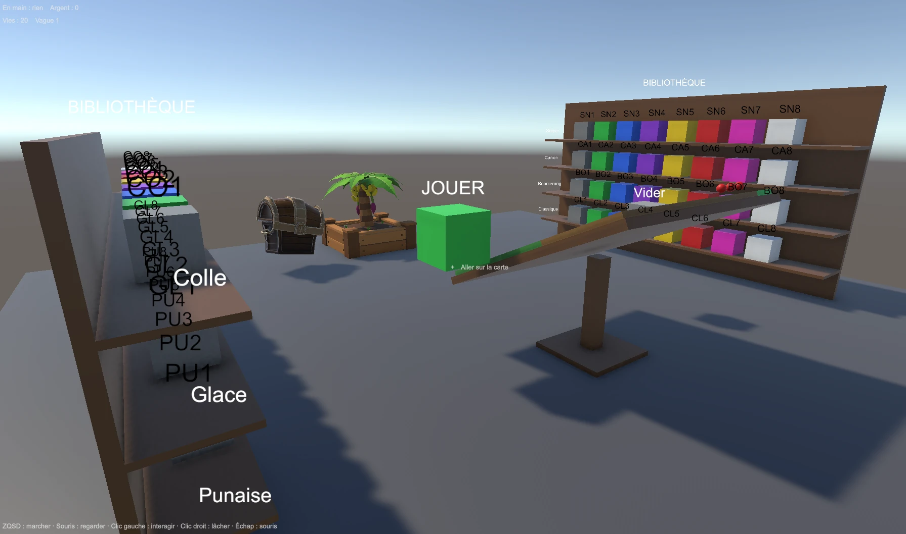
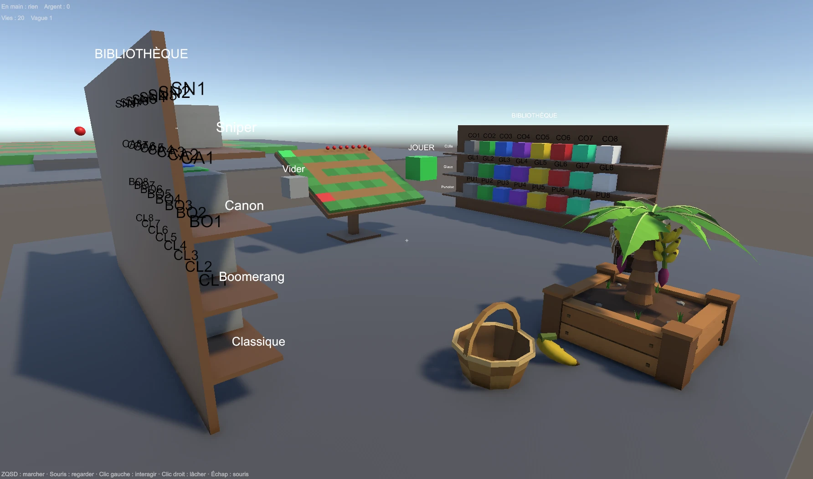

# Journal de bord — Général (équipe)

_Vue d'ensemble : décisions, jalons, blocages communs. Le détail de chacun est dans son journal perso. Entrée la plus récente en haut._

| Journal perso | |
|---|---|
| [Dylan](dylan.md) · [Maxens](maxens.md) · [Nicolas](nicolas.md) | ce que chacun a fait, ses blocages, **son usage de l'IA** |

## Décisions
| Date | Décision | Pourquoi |
|---|---|---|
| 2026-10-05 | Idée retenue : tower defense VR univers Bloons (Quincy à l'arc + singes posés à la main) | Gestes VR forts (arc, saisir/poser, ramasser) |
| 2026-10-05 | Le plateau du hub = la carte en miniature, **en direct** (ballons, singes, joueurs). Placement libre des singes, sauf sur la piste et hors carte | Même vision au hub et sur la carte ; prépare un 2e joueur visible |
| 2026-10-05 | Hub et carte dans **une seule scène** (deux zones, téléportation) | Pour que la carte tourne pendant qu'on est au hub |
| 2026-10-05 | Prototype d'abord au clavier/souris (pas de casque dispo), VR ensuite | Valider les mécaniques sans attendre le matériel |
| 2026-10-05 | Un seul projet Unity en **6000.6** ; intégration des 3 prototypes (hub, coffres, bananier) sur `feat/integration` avant `main` | 3 projets séparés et 2 versions d'Unity ne pouvaient pas cohabiter dans `Unity/` |
| 2026-10-06 | **Pas d'interface collée à l'écran** : l'argent, les prix et les infos se lisent dans le décor du hub | En VR, un affichage collé au visage donne le vertige (règles de confort) |
| 2026-10-06 | Économie de départ : banane 5 (amélioration « valeur » +3), vague finie 20 + 10 × n°, coffre 25 (+20 par vague vaincue), améliorations du bananier 40 à 80 (×1,6 par niveau) | Premiers réglages, à équilibrer en jouant |
| 2026-10-06 | Le coffre suit la progression : **prix et qualité selon les vagues vaincues** (prix 25 + 20 / vague ; raretés débloquées par vague ; 1 singe de plus toutes les 3 vagues), chances affichées à côté du coffre | Récompenser l'avancée dans les vagues ; transparence des drops |
| 2026-10-06 | **Vagues** : lancées par un bouton LANCER ; vague perdue = on la rejoue (pas de retour à zéro) ; 10 vagues écrites à l'avance avec boss, ballons rapides et blindés, **victoire après le dirigeable rouge (vague 10)** puis mode infini. Coffre : arc-en-ciel et blanc par fusion seulement, raretés par paliers de vagues | Le joueur décide quand il est prêt ; pas de frustration de tout recommencer ; une vraie fin pour la démo, et de quoi continuer pour débloquer les raretés hautes (Dylan) |
| 2026-10-06 | **Passage à la VR** : plus de contrôles clavier/souris, on teste sans casque avec le **simulateur XR** de l'XR Interaction Toolkit. Déplacement par **téléportation** (deux sticks) + **rotation par crans**, pas de déplacement continu ; boutons et coffre **enfoncés avec la main** ; bananes sur une **table à hauteur de main** | Règles de confort ; gestes VR vrais dès maintenant (Dylan) |
| 2026-10-06 | **Deux modes de jeu** (menu SAE → Mode de jeu) : **VR** (casque, Quest Link) ou **PC** (clavier-souris) pour tester vite ; le build casque est toujours en VR | Tester sans casque sans passer par le simulateur XR (Dylan) |
| 2026-10-07 | **Le hub est une cabane modélisée dans Blender** (script `cabane.py`, source unique) ; Unity n'ajoute que colliders, téléportation et lumières. Même DA autour (prairie, montagnes, palmiers) | Un hub beau et cohérent, semi-réaliste comme Bloons TD 6 (Dylan) |
| 2026-10-05 | Git : `main` stable + une branche par tâche + PR relue | Éviter de casser le build commun |
| _à trancher_ | Nom du jeu · assets Bloons ou maison · périmètre définitif | Avant le GDD v1 (ven. 9 oct.) |

## Jalons
- [ ] Ven. 9 oct. — GDD v1 + prototype gris jouable
- [ ] Ven. 23 oct. — un autre groupe teste le jeu
- [ ] Ven. 13 nov. — rendu + oral

## Semaine 1 · 5-9 oct. — PROUVER
**Mer. 7 oct. — cabane + arc dans `main`**
- La cabane de Dylan (`test/cabane`) et l'arc de Quincy de Maxens (`feat/arc-quincy`) sont fusionnés et dans `main` (PR [#9](https://github.com/dyzlek/SAE501/pull/9)). Un seul conflit, dans le générateur de scène, résolu en gardant les deux.
- Testé en mode PC : hub dans la cabane (plateau, LANCER/JOUER, Vider, panier, coffre sur estrade, panneaux du bananier et du récolteur), arc sur la carte.
- À faire : régénérer la scène après `git pull` (menu SAE) ; arc trop grand en mode PC ; carte à passer dans la DA de la cabane ; tester au casque.

**Mar. 6 oct. — plan du jour**

**Objectif :** un prototype **jouable normalement, au casque**, avec les mécaniques de base reliées entre elles :
bananes → panier → argent → améliorer le bananier ou ouvrir un coffre → le coffre donne un singe → inventaire → poser sur le plateau → fusionner → lancer la vague → la vague finie rapporte de l'argent.
_Test de fin de journée : quelqu'un qui ne connaît pas le jeu enchaîne cette boucle au casque pendant 5 minutes sans aide._

**À harmoniser avant de commencer**
1. **Une seule liste de raretés.** Nicolas en a 7 (gris, vert, bleu, violet, jaune, rouge, LGBT), Dylan 8 (… rouge, arc-en-ciel, blanc). Proposition : garder **les 7 de Nicolas**, la LGBT étant affichée en arc-en-ciel.
2. **Le prix d'un coffre et le coût des améliorations.** Aujourd'hui, ouvrir le coffre ne coûte rien : il demande seulement d'avoir 5 d'argent.
3. **Le sens de « drop des singes »** : un singe qui sort du coffre, ou jeter un singe pour récupérer de l'argent ?

**À faire aujourd'hui**

*A. Une seule économie, de vrais coûts*
- Une seule bourse, `GameState.Money`. On supprime le `Wallet` du coffre et le pont entre les deux.
- Le coffre coûte de l'argent, avec un prix qui augmente (prévu dans le GDD).
- Améliorer le bananier coûte de l'argent : les 3 statistiques de Maxens (fréquence, pourriture, valeur) ont déjà leurs prix calculés. Il manque le paiement et un panneau d'amélioration près de l'arbre, avec 3 boutons à appuyer.
- Ce qui rapporte : les bananes et chaque vague finie. Les ballons éclatés ne rapportent rien (règle du GDD).
- L'argent est affiché dans le décor, sur un panneau près du panier, et plus seulement en haut de l'écran.

*B. Un vrai inventaire*
- La bibliothèque démarre vide. Chaque case affiche le nombre de singes possédés, et une case vide est grisée.
- Le coffre ajoute le singe gagné à l'inventaire. Le singe sort du coffre avec la couleur de sa rareté, puis va se ranger sur l'étagère.
- Poser un singe le retire de l'inventaire, le reprendre l'y remet, et fusionner en consomme 2 pour en créer 1.

*D. Un vrai système de vagues*
- Une phase de préparation, puis une phase d'attaque. La vague démarre quand on appuie sur un gros bouton dans le hub, et plus automatiquement. Pendant la préparation, on gère les bananes et le plateau.
- Une liste de vagues écrite à l'avance (nombre de ballons, couches, ballons cœur et blindés), plutôt qu'une formule.
- Une fin : victoire après la vague 10 et le dirigeable rouge, défaite à 0 vie, puis un bouton « Rejouer ».

*E. La VR : les gestes de base au casque*
- Le joueur VR : rig XR avec téléportation et rotation par crans, et le simulateur XR pour continuer à tester sans casque.
- Prendre un singe sur l'étagère avec la main (XR Grab).
- Le lâcher au-dessus du plateau, ce qui le pose, avec l'aperçu vert ou rouge sous la main.
- Le lâcher sur un singe identique, ce qui les fusionne, avec le halo blanc.
- Les bananes : les prendre et les lâcher dans le panier. Le prefab est déjà prêt pour la VR. Pour respecter les règles de confort, on évite d'avoir à ramasser au sol en boucle : les bananes tombent sur un plateau à hauteur de main.
- Les boutons (Jouer, lancer la vague, améliorations) s'enfoncent avec la main.
- Un premier build sur le casque, au plus tard en début d'après-midi.

_Ordre : A et B d'abord (tout le reste en dépend), le rig VR (E) en parallèle. Une branche par chantier, partie de `main`, en Unity 6000.6. La scène `Jeu.unity` n'a qu'un propriétaire (Dylan)._

**Lun. 5 oct.**
- Fait :
  - lancement de la SAÉ, dépôt GitHub, brouillon du GDD v0 (idée TD Bloons) ;
  - composition du groupe envoyée à Antoine ;
  - trois prototypes au clavier et à la souris : hub, plateau et carte (Dylan), coffres (Nicolas), bananier (Maxens) ;
  - tests croisés entre nous ;
  - intégration dans un seul projet Unity 6000.6 (`feat/integration`), avec un hub en cercle autour du joueur (plateau, bibliothèque, bananier et panier, coffre).
- Bloque : pas de casque disponible aujourd'hui, donc rien de testé en VR.
- Prochaine étape :
  - au coffre, faire sortir un singe de la rareté gagnée, qui rejoint la bibliothèque ;
  - rendre le plateau plus grand et alléger les textes ;
  - réserver les casques et choisir l'outil de suivi ;
  - GDD v1 pour vendredi.

**Captures de l'intégration** (les trois prototypes réunis dans le hub, en cercle autour du joueur) :

