# Journal de bord — Dylan

_Entrée la plus récente en haut. Une entrée par jour travaillé. Toute aide de l'IA est notée ici (outil, pour quoi, gardé/jeté)._

## Mer. 7 oct. 2026
- **Fait :** fusion de ma cabane (`test/cabane`) avec l'arc de Maxens (`feat/arc-quincy`) dans une nouvelle branche `feat/cabane-arc`. Un seul conflit, dans le générateur de scène : on garde la place du coffre de la cabane (estrade, texture bois) et le passage du point d'apparition sur la carte au joueur PC (pour l'étui de l'arc).
  - ajout des derniers commits de Maxens (mains de Quincy, arc plus petit, tir dans le simulateur) ; Pull Request [#9](https://github.com/dyzlek/SAE501/pull/9) fusionnée dans `main` ;
  - scène régénérée et testée en mode PC : la cabane, le hub et l'arc de Quincy fonctionnent ensemble.
  - branche `fix-all` : corrections d'une partie des deux critiques (la mienne et celle de Maxens), voir le détail ci-dessous.
- **Bloque :** sur la carte, l'arc en mode PC est grand et cache le bas de l'écran ; la carte reste en cubes gris (pas encore dans la DA de la cabane).
- **Demain :** tester `fix-all` (PC puis casque) et faire la Pull Request vers `main` ; voir le plan du 8 oct. dans le [journal général](GENERAL.md).

**Captures après la fusion (mode PC)**

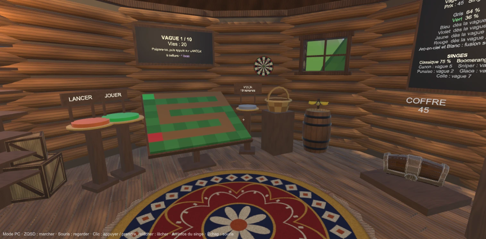

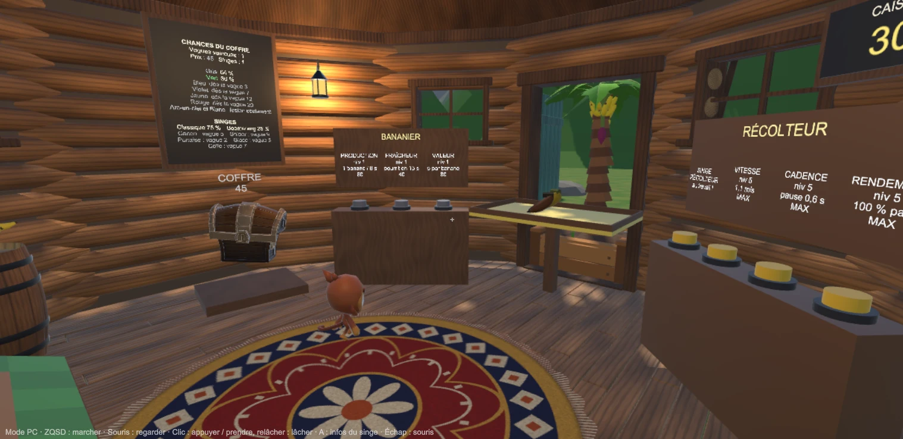

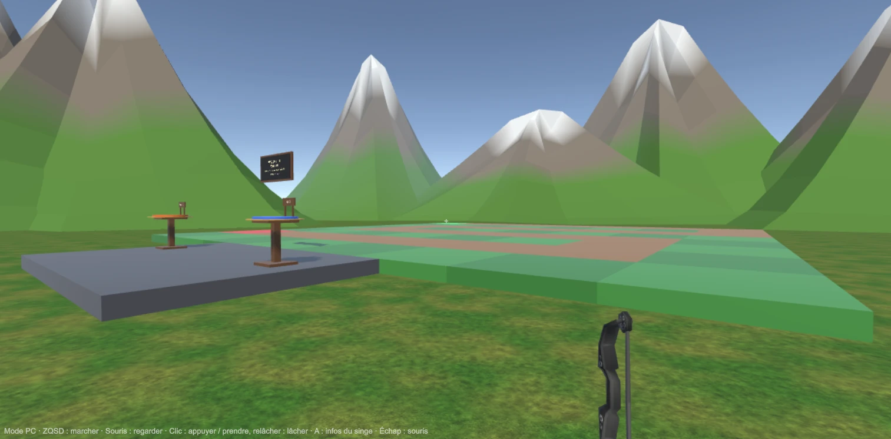

_L'analyse critique de Maxens du même jour est dans [son journal](maxens.md) : je la corrige aussi sur `fix-all`._

**Ma troisième analyse critique** _(bugs et défauts à corriger sur la branche `fix-all`)_
1. **On peut faire voler des objets avec la banane** (« prop fly ») : en tenant une banane, on pousse les objets du décor et on peut les envoyer en l'air.
2. **L'affichage sur les écrans n'est pas beau**, même s'il reste lisible.

   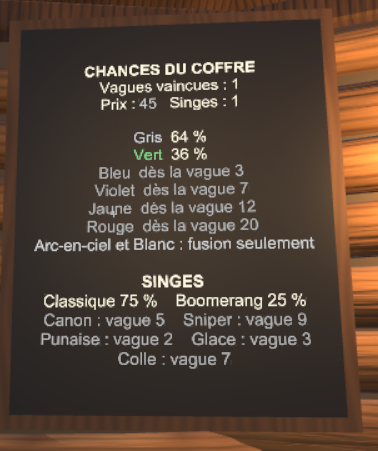
   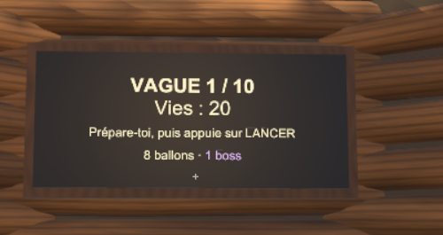
3. **Des objets se superposent.**

   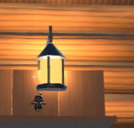
   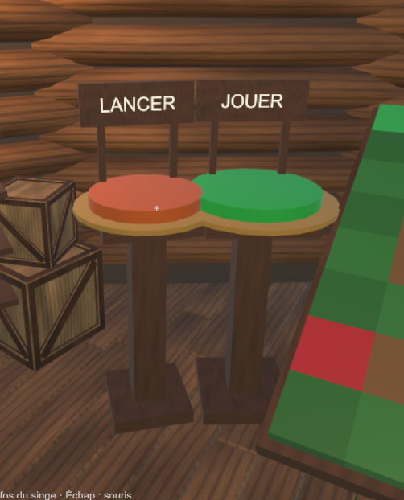
4. **Le texte qui flotte dans le vide est moche**, par exemple sur la bibliothèque : il faudrait le mettre sur une pancarte ou un support.

   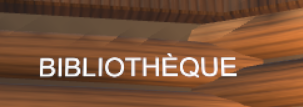
5. **Les panneaux et certains objets ne sont pas beaux.**

   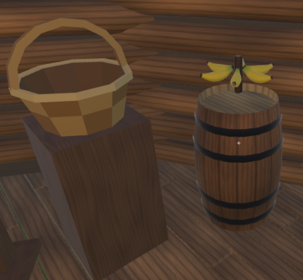
6. **Les bornes d'amélioration ne sont vraiment pas belles.**

   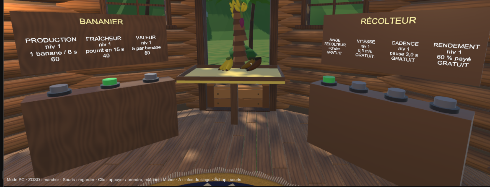
7. **Le petit singe (récolteur) rentre dans les objets.**

   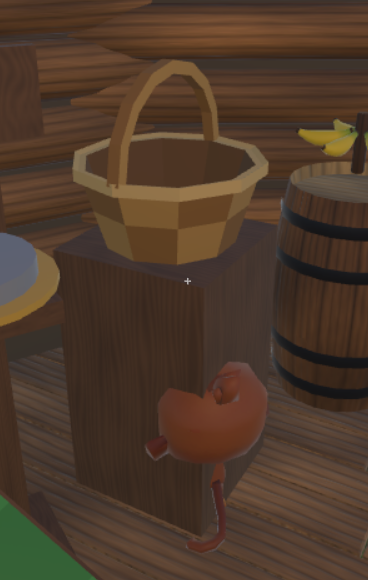
8. **Le terrain n'est pas beau.**

   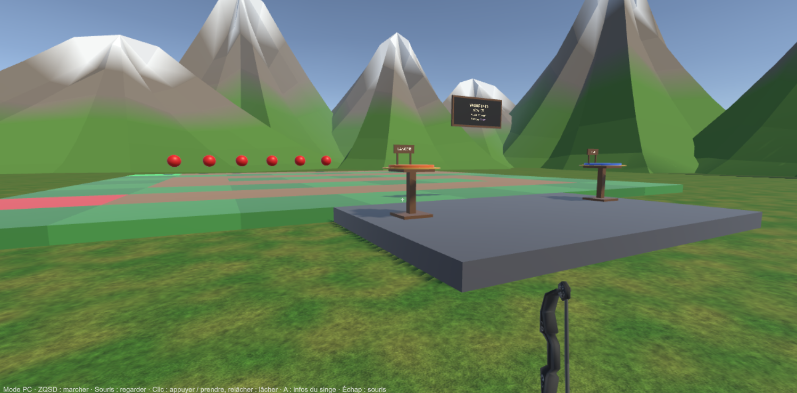

**Corrigé sur `fix-all`** _(code écrit par l'IA, compilé, pas encore testé dans Unity : il faut régénérer la scène)_
- **Objets qui volent avec la banane** : le joueur ne se cogne plus aux bananes ni au singe qu'il tient ; avant, il pouvait monter dessus et s'envoler.
- **Objets superposés** : LANCER et JOUER sont réunis sur un seul pupitre ; les caisses et le tonneau sortent de la cabane (caisses sur la terrasse et sous l'étal) ; la lanterne qui tombait dans la bibliothèque est déplacée au-dessus du pupitre (modèle Blender réexporté).
- **Singe récolteur qui traversait les meubles** : sur un long trajet, il passe par le milieu de la pièce ; il s'arrête devant le tabouret du panier au lieu de rentrer dedans.
- **Textes et écrans** : deux vraies polices (Bangers pour les titres, Oswald pour lire, licence libre) ; tous les tableaux deviennent des ardoises encadrées, titres dorés, texte à la craie.
- **Texte dans le vide** : « BIBLIOTHÈQUE » sur une enseigne posée sur le meuble (il ne se tourne plus vers le joueur), les noms des types sur des plaques, le prix du coffre sur une petite pancarte devant l'estrade.
- **Bornes d'amélioration** : de vrais comptoirs en bois (portes, plateau foncé), une ardoise avec une colonne par bouton, une enseigne avec le titre ; boutons ronds cerclés de laiton, verts ou gris (plus de jaune).
- **Récolteur** : on peut acheter **jusqu'à 4 singes** (le bouton d'achat reste) ; les améliorations valent pour toute l'équipe ; deux singes ne courent jamais après la même banane. Les boutons au niveau max **disparaissent** (récolteur et bananier) et l'ardoise affiche MAX.
- **Zone du bananier** : la table jaune sur un seul pied devient un étal en bois (4 pieds, rebords, étagère basse avec une caisse) avec une feuille de bananier : les bananes ressortent sur le vert. Le panier est sur un tabouret rond au lieu d'un cube.
- **LANCER / JOUER** : un pupitre au dessus incliné, gros boutons ronds cerclés de laiton, nom gravé sur une plaque devant chaque bouton (même pupitre sur la carte avec LANCER / HUB, et VIDER à droite du plateau).
- **Tonneau** : retiré de la cabane.
- **Après mon test (2e passe)** :
  - boutons deux fois trop gros qui dépassaient et cachaient leurs plaques : le cylindre utilisé sortait deux fois trop large ; boutons plus petits et bien posés ;
  - on ne comprenait pas à quoi servaient certains boutons : chaque bouton de comptoir a maintenant une plaque gravée devant lui (PRODUCTION, FRAÎCHEUR, VALEUR, +1 SINGE, VITESSE, CADENCE, RENDEMENT) ;
  - l'enseigne au-dessus des améliorations flottait : elle est posée sur l'ardoise et tenue par les deux montants ;
  - noms de la bibliothèque peu lisibles : plaques claires au bord des étagères, texte foncé plus grand ;
  - meubles trop collés : écarts agrandis (pupitres, panier, comptoirs, étal un peu moins large), vérifiés par calcul ;
  - JOUER devient « SE TP ».
- **3e passe** : plus de « +0 » qui flotte quand une amélioration est gratuite ; plaques des boutons en bois foncé avec le texte doré, plus grand (le texte foncé sur le laiton ne se lisait pas) ; texte des ardoises un peu plus grand.
- **Mes objectifs du jour** (branche `feat/deux-scenes`, partie de `fix-all`) :
  - **deux vraies scènes** : `Hub.unity` et `Labyrinthe.unity`, avec un **vrai changement de scène** (SE TP / HUB) ; chaque scène a son joueur (l'arc seulement sur la carte) ; argent, inventaire, singes posés, vagues gagnées, niveaux du bananier et récolteurs sont gardés ; LANCER au hub emmène sur la carte et lance la vague ; HUB est grisé pendant une vague ; le plateau du hub montre les singes posés (plus les ballons en direct) ;
  - **zone de téléportation du hub** : seulement un disque de 1,9 m au centre de la cabane.
- **Décor des deux scènes** (sans toucher au labyrinthe) :
  - **plus de végétation** autour de la cabane : massifs d'herbe haute, massifs de fleurs, plus de buissons, de rochers et de palmiers (modèle Blender) ;
  - **le même paysage autour du labyrinthe** : prairie, végétation, palmiers et montagnes à la place du sol gris ; estrade, pupitre et poteaux du tableau en bois ;
  - **lumière** : après plusieurs essais de rayons dessinés (trop artificiels, ils traversaient les meubles), on garde la vraie lumière : soleil chaud aux ombres douces (taches de soleil sur le plancher derrière les fenêtres), lumière ambiante en trois tons, poussières dorées qui flottent dans le soleil aux fenêtres et à la porte, et réglages de l'image (tons naturels, couleurs un peu plus vives, léger halo, coupé sur le casque pour tenir 72 i/s).

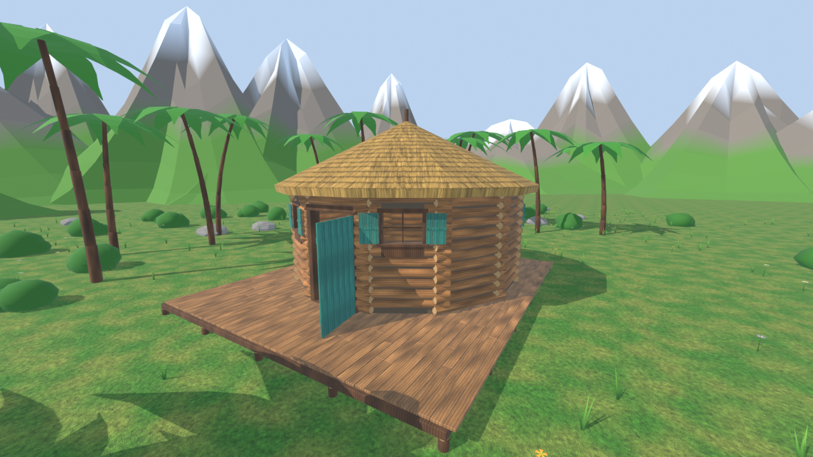

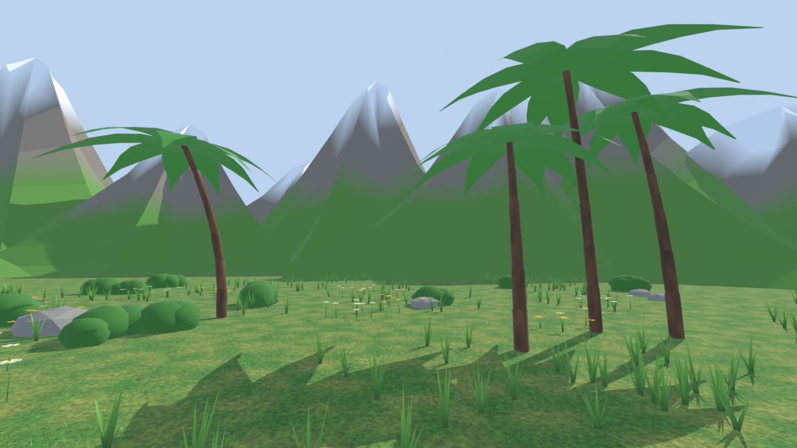
- **Critique de Nicolas (1re partie)** :
  - **fiche du singe** (touche A) refaite comme les ardoises du hub (cadre en bois, titre doré, texte à la craie) et dessinée par-dessus le décor : un meuble ne la cache plus ;
  - **bûches qui débordaient sur les fenêtres** : dans `cabane.py`, les rondins qui touchent une fenêtre sont coupés et leurs bouts se cachent dans les montants, un panneau bouche le vide sous l'appui ; caméras réglées (affichage de 3 cm à 400 m) pour que les surfaces proches clignotent moins ;
  - **chute dans le vide** : le joueur qui tombe sous le sol revient au point d'arrivée le plus proche (hub ou carte).
- _Pas encore traité :_ le modèle du bananier lui-même (c'est l'asset de Maxens), le texte « [Touche] Ouvrir le coffre » et la roulette (le coffre est la tâche de Maxens aujourd'hui).

| Outil | Pour quoi | Gardé / jeté |
|---|---|---|
| Claude (Claude Code) | Fusion `test/cabane` + `feat/arc-quincy` (Maxens) dans `feat/cabane-arc`, conflit du `PrototypeGenerator` résolu en gardant les deux | À tester |
| Claude (Claude Code) | 2e fusion avec les derniers commits de Maxens sur `feat/arc-quincy` (mains de Quincy riggées, arc plus petit, tir dans le simulateur VR), sans conflit ; PR #9 ouverte (le merge par Claude a été bloqué faute de relecture, fusionnée ensuite sur GitHub) | Gardé (testé par moi en mode PC) |
| Claude (Claude Code) | Mise à jour de mon journal et du journal général avec mes 3 captures | Gardé |
| Claude (Claude Code) | Mise en forme de ma troisième analyse critique (depuis mon fichier Word, avec ses 9 captures) et des objectifs du jour dans le journal général, branche `fix-all` ; rien de corrigé pour l'instant | Gardé |
| Claude (Claude Code) | Mise en forme de l'analyse critique de Maxens (qu'il m'a transmise) dans son journal, pour la corriger sur `fix-all` | Gardé |
| Claude (Claude Code) | Corrections sur `fix-all` de 11 points des deux critiques : bug des objets qui volent (`PlayerRig.IgnoreCollisions`), pupitres de commande, comptoirs d'amélioration avec ardoise, boutons qui disparaissent au max, jusqu'à 4 singes récolteurs (`HarvesterCrew` ; `HarvesterSetup` supprimé, tout est construit par le générateur), trajets des singes par le centre, polices Bangers et Oswald, enseignes et pancartes au lieu des textes flottants, étal des bananes, tabouret du panier, lanterne déplacée dans `cabane.py` | À tester (compilé, scène à régénérer) |
| Claude (Claude Code) | 2e passe après mon test : cylindre corrigé (boutons deux fois trop gros), boutons plus petits, plaques gravées devant les boutons des comptoirs, enseigne posée sur l'ardoise, plaques de la bibliothèque lisibles, meubles plus espacés, JOUER renommé « SE TP » | À tester (compilé, scène à régénérer) |
| Claude (Claude Code) | 3e passe : « +0 » supprimé (MoneyBoard ignore un montant nul), plaques des boutons lisibles (bois foncé, texte doré plus grand), texte des ardoises agrandi | À tester (compilé, scène à régénérer) |
| Claude (Claude Code) | Critique de Nicolas, 1re partie : fiche du singe restylée et dessinée par-dessus le décor (shader « SAE/Texte 3D » avec ZTest réglable), rondins coupés autour des fenêtres dans `cabane.py` (cabane réexportée), caméras 3 cm à 400 m, `FallGuard` (retour au point d'arrivée le plus proche après une chute) | À tester (compilé, scène à régénérer) |
| Claude (Claude Code) | Fusion de `feat/coffre-maxens` (nouveau coffre de Maxens) dans `fix-all` : conflits résolus en gardant les deux (générateur : son coffre fixe + mes comptoirs ; pancarte du prix : « COFFRE » pendant l'ouverture ; journal de Maxens : ses deux entrées) ; coffre décalé à 97° (son estrade fait 1,4 m) | À tester |
| Claude (Claude Code) | LANCER qui ne faisait rien au casque (build) : cause non trouvée sans casque (le lien vers les vagues est bien dans la scène). Ajouts : LANCER devient gris pendant une vague (on voit si elle est partie), il retrouve les vagues tout seul si le lien manque, et le bouton B de la manette droite lance la vague de partout | À tester au casque |
| Claude (Claude Code) | Journal général : bilan du 7 oct. et plan du 8 oct. (tâches données par l'équipe) | Gardé |
| Claude (Claude Code) | `main` fusionné dans `fix-all` (sans conflit), branche poussée, Pull Request [#11](https://github.com/dyzlek/SAE501/pull/11) vers `main` ouverte (à relire et fusionner sur GitHub ; pas encore testée dans Unity) | Gardé |
| Claude (Claude Code) | Deux scènes (`Hub` + `Labyrinthe`, chargement additif par `LevelLoader`, points d'arrivée `LevelSpawn`, `WaveSpawner.Instance` au lieu des liens entre scènes, carte à 500 m sur une prairie, `Jeu.unity` supprimée à la génération) et zone de téléportation du hub limitée à un disque de 1,9 m | À tester (compilé, scènes à générer) |
| Claude (Claude Code) | Depuis la carte, on voyait les montagnes du hub dans la brume : carte éloignée à 1 km (au-delà de la distance d'affichage) | À tester |
| Claude (Claude Code) | Vrai changement de scène à la place du chargement additif : `Levels` (`SceneManager.LoadScene`), un joueur par scène, état gardé en static (`HarvesterCrew`, `UpgradeButton`), `WaveSpawner` reprend au bon numéro et lance à l'arrivée, plateau du hub refait à partir de `GameState`, `LevelLoader`, `BowHolster`, `Mirrored` et `KeepWorldScale` supprimés | À tester (compilé, scènes à générer) |
| Claude (Claude Code) | Décor : `cabane.py` (massifs d'herbe et de fleurs, plus de buissons, rochers et palmiers ; nouveau `Paysage.glb` pour la carte, zone de jeu libre), rayons de soleil en maillages transparents (porte et fenêtres du hub, grands rayons sur la carte), soleil identique dans les deux scènes, estrade et pupitres de la carte en bois | À tester (compilé, rendus Blender vérifiés, scènes à générer) |
| Claude (Claude Code) | Rayons trop forts et « artificiels » dans la cabane : beaucoup plus légers et sans bord net (transparents sur les arêtes, lueur au milieu) ; rayons du ciel qui partent de 150 m (on ne voit plus leur sommet en forme de boîte) | À tester |
| Claude (Claude Code) | Rayons qui traversaient les comptoirs et bouts visibles dans le ciel : lueurs courtes aux fenêtres (0,8 m, s'éteignent avant les ardoises), plus de rayon à la porte ; rayons du ciel effacés aux deux bouts | À tester |
| Claude (Claude Code) | Rayons dessinés abandonnés (jeté : toujours artificiels). À la place : soleil réglé (ombres douces, couleur chaude), ambiance en trois tons, poussières dorées en particules dans le soleil, volume de réglages de l'image (`Art/Lumiere.asset` : tons, couleurs, balance des blancs, halo coupé sur le casque par `MobileLighting`), ombres du Quest sur 25 m (plus nettes) | À tester |
| Claude (Claude Code) | Branche `fusion` (depuis `feat/deux-scenes` + `main`) : ajout des ballons de Maxens (`feat/coffre-maxens` : modèles, MOAB, BFB, cœur) et des améliorations de l'arc de Nicolas (`feat/arc-upgrade`). Conflits : plateau du hub gardé en version deux scènes (la miniature des ballons de Maxens ne sert plus, la carte n'étant plus chargée au hub), `Balloon` réunit la régénération du cœur (Maxens) et la perforation par couches (Nicolas), le pupitre ARC est posé sur l'estrade de la nouvelle scène Labyrinthe | À tester (compilé) |
| Claude (Claude Code) | Pouvoir revenir au hub pendant une vague (la vague continue) : les deux scènes restent chargées (le hub charge le labyrinthe en arrière-plan), chaque scène a sa « présence » (joueur, soleil, réglages d'image) allumée seulement quand on y est (`Levels.Go`, `LevelPresence`) ; HUB n'est plus grisé pendant une vague ; le plateau du hub montre de nouveau les ballons en direct (miniatures de Maxens réutilisées) ; récolteurs et bananier redeviennent normaux (plus besoin de static) | À tester (compilé) |
| Claude (Claude Code) | Mise en forme de l'analyse critique de Nicolas (qu'il m'a transmise) dans son journal, avec ses 2 photos ; rien de corrigé pour l'instant | Gardé |

## Mar. 6 oct. 2026
- **Fait :**
  - remarque de départ : le palmier de Maxens est trop petit dans le hub, il faut l'agrandir (fait : ×1,6) ;
  - chantier A, **une seule économie avec de vrais coûts** (branche `feat/economie`), sans aucun affichage collé à l'écran, parce qu'en VR ça donne le vertige. Tout se lit dans le décor du hub :
    - une **caisse** en bois avec l'argent total, dont le chiffre défile et qui clignote vert ou rouge ;
    - des « +5 » / « −25 » qui flottent là où l'argent bouge ;
    - un **panneau d'amélioration** du bananier avec 3 gros boutons ;
    - le **prix du coffre**, affiché au-dessus de lui.
- **Bloque :** —
- **Demain :** _

**Captures de l'économie dans le hub**

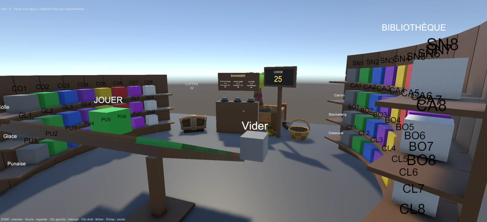

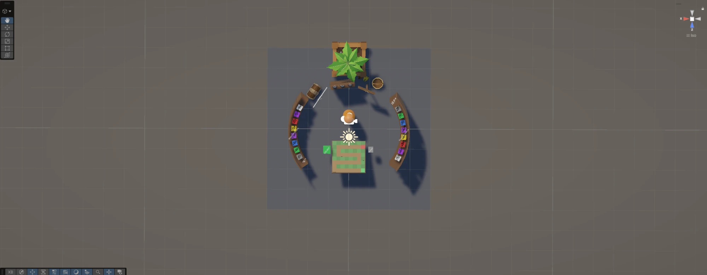

**Captures du singe récolteur** _(branche `feat/singe-recolteur`, mode PC)_

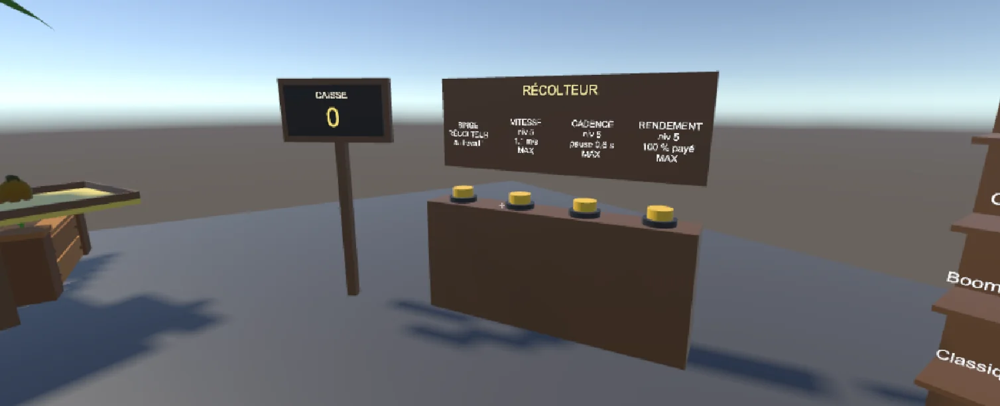

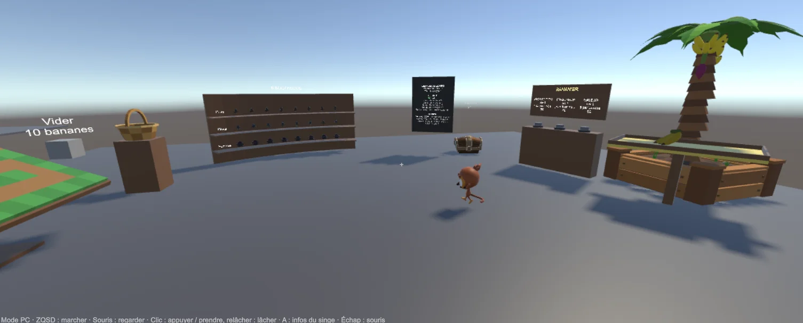

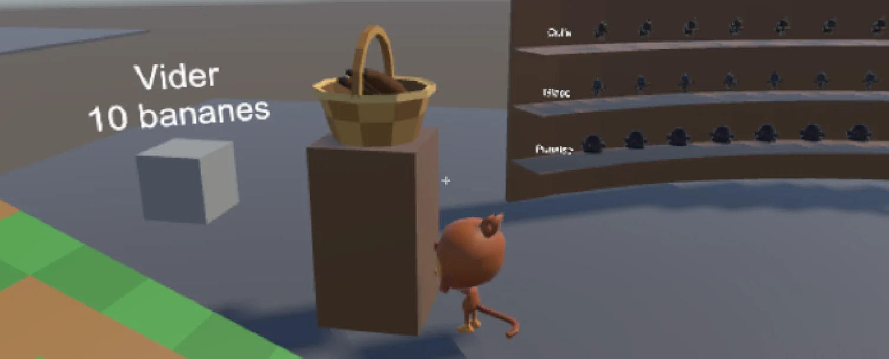

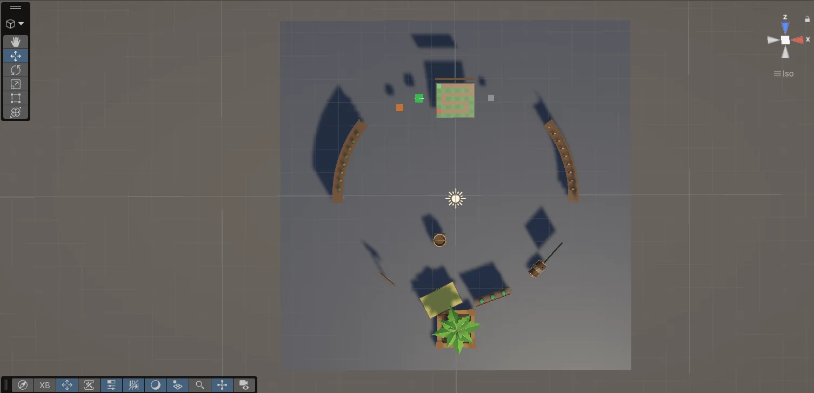

**Cabane v1** _(branche `test/cabane`, avant la v2 plus serrée et texturée)_

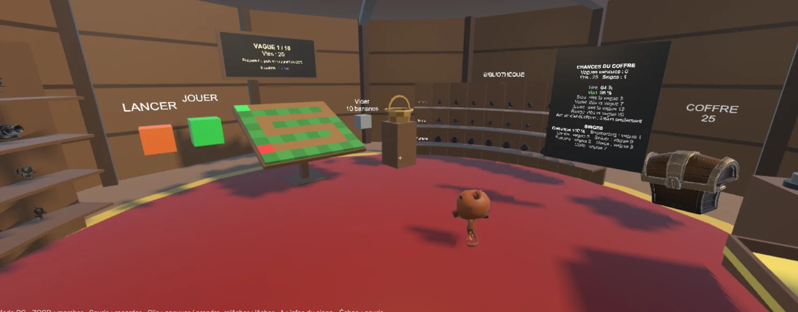

**Cabane v3** _(rendus Blender de `Blender/cabane.py`, sans les meubles du jeu)_

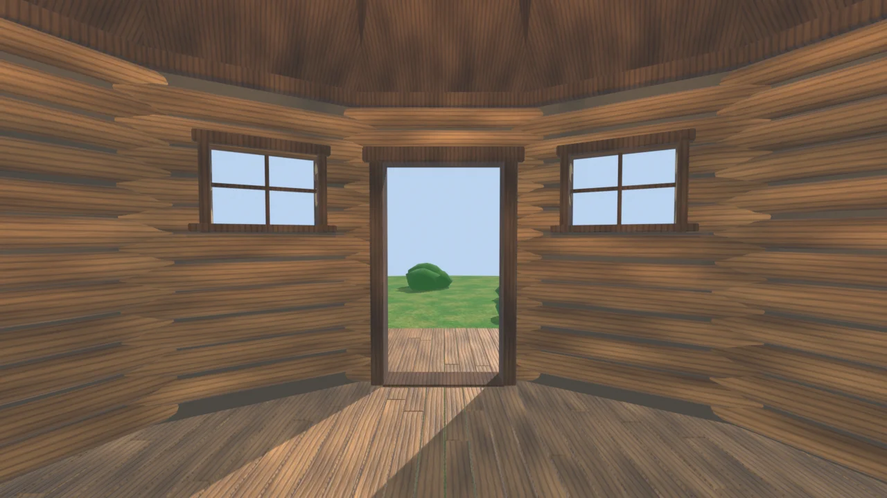

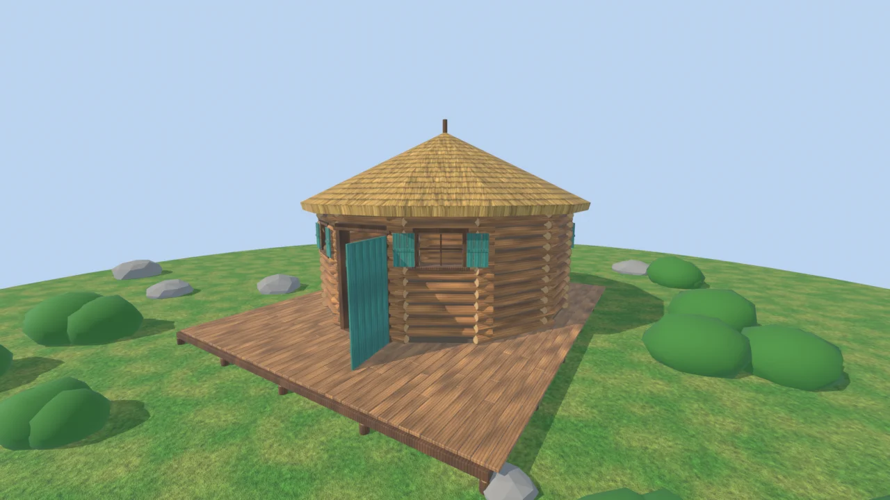

**Cabane v4** _(rendus Blender : montagnes et palmiers autour)_

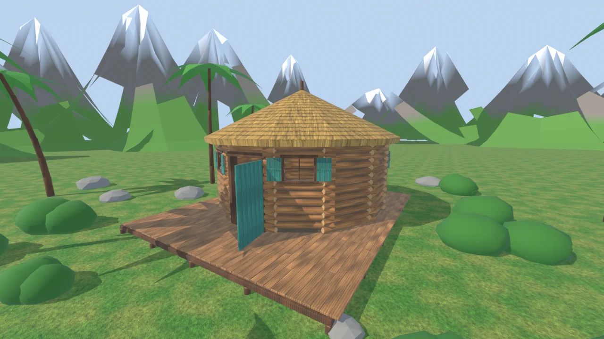

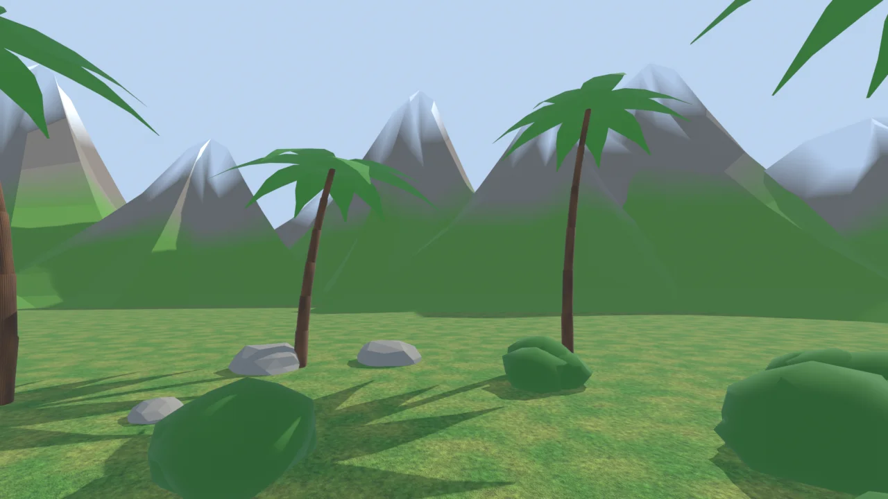

**Mon analyse critique** _(corrigée dans la foulée, à tester)_
1. **Le hub est trop petit.** On est trop serré, les éléments sont les uns devant les autres : c'est compliqué de circuler et d'utiliser les objets.
2. **Le prix et la qualité du coffre doivent dépendre des vagues vaincues.** Plus on bat de vagues, plus le coffre est cher, mais plus il est intéressant : il donne plus de singes et de meilleur niveau.
3. **Afficher les probabilités de drop** du coffre (chances par rareté), et les informations qui vont avec.
4. **Les bananes ne doivent plus traverser le bananier.** Aujourd'hui, elles peuvent passer à travers et rester cachées autour, à des endroits inaccessibles.

**Autres points vus sur les captures** _(notés par l'IA)_
- Les textes au-dessus des cubes de la bibliothèque se chevauchent encore (CA5, CA6…), et ceux des boutons du panneau BANANIER sont trop petits pour être lus.
- Le cube « Vider » et le pied du plateau gênent le passage devant le joueur.
- Les vies et la vague sont encore affichées à l'écran (prévu avec le chantier D).

**Mon schéma du hub en cercle**
Le hub était plus espacé, mais pas encore assez. J'ai dessiné une disposition où tout suit vraiment un cercle (rouge), avec le centre libre pour circuler :
- le **plateau** (carré marron) est reculé sur le cercle, devant le joueur, avec le bouton **JOUER** (orange) juste à côté ;
- les deux **bibliothèques** (vert) sont courbes et suivent le cercle sur les côtés ;
- le **bananier** (BANANE) est au fond, avec le panier (rond marron) et la **zone de chute des bananes** (jaune) devant lui ;
- le **coffre** (chest) est en haut à gauche, sur le cercle.

**Captures du hub en cercle** (base de ma deuxième analyse)

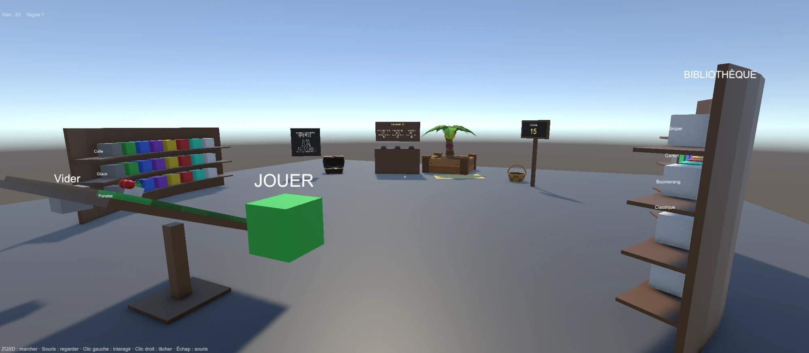

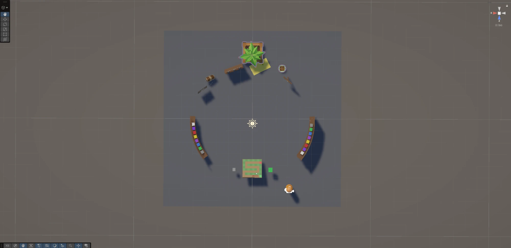

**Ma deuxième analyse critique** _(corrigée dans la foulée, à tester après avoir régénéré la scène)_
1. **Un bouton pour lancer la vague à la main.** Le joueur décide quand il est prêt, au lieu que la vague parte toute seule.
2. **Perdre une vague ne fait pas tout recommencer.** On reprend au début de la vague perdue, pas à la vague 1.
3. **Un ou plusieurs boss à chaque vague** : des ballons plus gros que les autres.
4. **Les raretés élevées du coffre se débloquent plus tard**, par paliers de vagues (par exemple après la vague 20, etc.).
5. **Les singes blancs et arc-en-ciel ne sortent jamais du coffre.**
6. **Plus de vies ni de numéro de vague affichés à l'écran** : une interface collée au visage en VR donne la nausée. Ces informations doivent se lire dans le décor.

### IA
| Outil | Pour quoi | Gardé / jeté |
|---|---|---|
| Claude (Claude Code) | Économie unique (`Economy`) : bananes et vagues rapportent, coffre et améliorations coûtent ; `Wallet` et pont supprimés ; caisse dans le décor, « +/− » flottants, panneau d'amélioration du bananier (3 boutons qui s'enfoncent, vert si payable), prix du coffre qui augmente (25, +30 % par coffre) et affiché au-dessus ; argent retiré de l'affichage écran ; palmier ×1,6 ; coin « économie » réorganisé derrière le joueur | À tester |
| Claude (Claude Code) | Mise en forme de mon analyse critique du hub et ajout de mes captures (rien de corrigé pour l'instant, à ma demande) | Gardé |
| Claude (Claude Code) | Corrections de mon analyse critique : hub agrandi (cercle de 4 m, sol 12 × 12 m, éléments espacés, boutons hors du passage) ; coffre qui dépend des vagues vaincues (prix 25 + 20 par vague, raretés débloquées par vague, 1 singe de plus toutes les 3 vagues) ; panneau des chances à côté du coffre ; bananes remises hors du bac si elles s'y coincent ; plus de textes sur les cubes de la bibliothèque ; textes du panneau du bananier agrandis | À tester |
| Claude (Claude Code) | Hub refait d'après mon schéma : tout posé sur un cercle de 5 m (centre libre), plateau reculé sur le cercle devant avec JOUER/Vider à côté, bibliothèques courbes sur les côtés, bananier au fond avec une zone de chute des bananes devant lui, panier et caisse d'un côté, panneau d'amélioration et coffre de l'autre | À tester |
| Claude (Claude Code) | Mise en forme de ma deuxième analyse critique (vague lancée à la main, reprise à la vague perdue, boss à chaque vague, raretés par paliers, blanc et arc-en-ciel absents du coffre, vies et vague retirées de l'écran) et ajout de mes 2 captures du hub en cercle ; rien de corrigé pour l'instant | Gardé |
| Claude (Claude Code) | Corrections de ma deuxième analyse : bouton LANCER (hub et carte), la vague ne part plus toute seule ; vague perdue = on la recommence avec les vies du départ (singes et argent gardés) ; 1 boss par vague (+1 toutes les 5 vagues), gros ballon violet lent et solide ; coffre sans arc-en-ciel ni blanc (fusion seulement), raretés par paliers (Bleu 3, Violet 7, Jaune 12, Rouge 20 vagues) ; vies et vague retirées de l'écran, affichées sur un tableau au-dessus du plateau et sur la carte | Gardé (testé et validé par moi) |
| Claude (Claude Code) | Scène régénérée commitée, branche `feat/economie` poussée et fusionnée dans `main` par Pull Request (pas de remplacement forcé de main : `main` était déjà contenu dans la branche, rien n'est perdu) | Gardé |
| Claude (Claude Code) | Chantier B, vrai inventaire (branche `feat/inventaire`) : bibliothèque vide au départ, chaque case affiche le nombre de singes (grisée et plus petite si vide) ; prendre un singe le sort de l'inventaire, clic droit ou clic sur une case le range, « Vider » range tous les singes posés, la fusion consomme 2 singes pour en créer 1 ; le coffre donne des singes (type au hasard, rareté tirée) qui sortent avec une **aura de la couleur de leur rareté** puis volent jusqu'à leur case | Gardé (testé et validé par moi) |
| Claude (Claude Code) | Un singe Classique gris offert au départ ; chances de drop par **type** de singe au coffre : au début seulement des Classiques, puis les autres arrivent petit à petit (Boomerang vague 1, Punaise 2, Glace 3, Canon 5, Colle 7, Sniper 9), affichées sur le panneau des chances (agrandi) | Gardé (testé et validé par moi) |
| Claude (Claude Code) | Chantier D, vrai système de vagues : 10 vagues écrites à l'avance (groupes de ballons normaux, **rapides**, **blindés** qui prennent moitié moins de dégâts et ne se ralentissent pas, boss), **dirigeable rouge** à la vague 10, victoire puis mode infini ; tableau de la vague avec la composition de la prochaine vague. **Fiche des singes** dans le décor quand on vise un singe (bibliothèque, plateau, carte) : effet, dégâts, portée, cadence, cibles et gain de la fusion, plus le cercle de portée sur le plateau et la carte | Gardé (testé et validé par moi) |
| Claude (Claude Code) | La fiche du singe ne s'affiche plus toute seule : il faut viser le singe **en maintenant A** (clavier AZERTY), ou le bouton A de la manette droite en VR ; aide en bas de l'écran mise à jour | Gardé (testé et validé par moi) |
| Claude (Claude Code) | Scène régénérée commitée, branche `feat/inventaire` poussée et fusionnée dans `main` par Pull Request | Gardé |
| Claude (Claude Code) | Nouvelle branche `feat/vr-maxens` : le travail de Maxens (commit 1cc56b1 : singes 3D, aura en prefab) + ma VR. Seul conflit de code : la case de la bibliothèque, où le singe 3D de Maxens est maintenant celui qu'on saisit. Ajout d'un menu **SAE → Mode de jeu : VR / PC (clavier-souris)** : les deux joueurs sont dans la scène et le bon est activé au lancement ; en mode PC, ZQSD + souris, clic pour appuyer ou prendre/lâcher (singe posé là où on vise, banane dans le panier), A pour la fiche ; le casque (Android) est toujours en VR | À tester |
| Claude (Claude Code) | **Prendre de loin, jusqu'à 2 m** les singes et les bananes, en VR comme en mode PC : en VR, un filtre (`GrabReach`) sur le XR Grab empêche de les attraper au-delà de 2 m de la main (avant : jusqu'à 10 m), le rayon ne devient bleu qu'à portée ; en mode PC, le clic prend jusqu'à 2 m ; les boutons et le coffre restent utilisables de plus loin | À tester |
| Claude (Claude Code) | Correction d'après mes captures : le rayon devenait bleu et prenait le singe même en passant à côté (le Near-Far détecte avec un cône de 6°). `HandRay` passe maintenant la détection en rayon exact au démarrage : il faut pointer sur le singe pour interagir | À tester |
| Claude (Claude Code) | Le rayon exact ne survolait plus rien, même en pointant le singe (capture) : le tir de détection partait d'une origine lissée (stabilisation du caster des Starter Assets) différente du rayon dessiné. `HandRay` coupe la stabilisation et dessine le rayon depuis l'origine réelle du tir | À tester |
| Claude (Claude Code) | « De loin ça ne marche pas, je dois le coller » : le hub est un cercle de 5 m et les bibliothèques sont dessus, donc ma limite de 2 m les rendait inatteignables depuis le centre. Portée de prise passée à **6 m** (`GrabReach.Reach`, VR et PC) | À tester |
| Claude (Claude Code) | Aide pour le premier build casque (mode développeur, débogage USB autorisé, Build and Run sur « Default device ») ; scène régénérée et réglages du build commités, branche `feat/ajout-vr` poussée | Gardé |
| Claude (Claude Code) | Rayon toujours pas visible sur les manettes (d'après ma capture) : le rayon des Starter Assets est éteint et remplacé par le nôtre (`HandRay`), droit, qui part de chaque manette, blanc, bleu quand il vise quelque chose d'utilisable, caché quand la main tient un objet ; mots LANCER / JOUER remontés au-dessus des cubes | À tester |
| Claude (Claude Code) | Plus adapté à la VR : **les vies repartent à 20 à chaque vague** ; **rayon blanc toujours visible** au bout des manettes (3 m, il ne disparaît plus) pour viser les boutons, les bananes et les singes ; boutons et coffre activés en les visant + **gâchette** (ou grip) ; **singe posé de loin** là où pointe le rayon de la main qui le tient (rayon blanc jusqu'au plateau ou à la carte) ; lignes (rayon, cercle de portée, tirs) passées sur le shader compatible casque | À tester |
| Claude (Claude Code) | Correction d'après ma capture : les textes étaient décalés (sous les cubes, à côté du tableau). Le shader de texte était écrit pour l'ancien rendu de Unity : réécrit pour URP, qui donne la bonne caméra à chaque œil | À tester |
| Claude (Claude Code) | Textes réparés au casque : nouveau shader « SAE/Texte 3D » (celui de Unity ne gère pas l'affichage stéréo : texte dans un seul œil, visible à travers les murs) et textes qui restent droits face au joueur ; boutons, améliorations et coffre utilisables **de loin** (viser avec le rayon + grip), qui grossissent quand on les vise, avec vibration | À tester |
| Claude (Claude Code) | Correction : avec Quest Link, la tête et les manettes ne bougeaient pas, car le simulateur XR se lançait quand même et remplaçait le vrai casque. Le simulateur ne démarre plus que si aucun casque n'est branché (`SimulatorWhenNoHeadset`) | À tester |
| Claude (Claude Code) | Chantier E, la VR (branche `feat/ajout-vr`) : rig XR des Starter Assets (téléportation sur les deux sticks, rotation par crans, pas de déplacement continu) et simulateur XR lancé tout seul dans l'éditeur ; menu **SAE → Configurer la VR** (OpenXR + Meta Quest, Android IL2CPP/ARM64/API 32, couche Teleport) ; singes à saisir sur l'étagère (XR Grab), lâchés au-dessus du plateau = posés, sur un singe identique = fusionnés, ailleurs = rangés, avec l'aperçu vert/rouge et le halo ; boutons, coffre et améliorations enfoncés avec le bout du doigt, avec vibration ; bananes sur une **table à hauteur de main** et panier sur un socle ; fiche du singe en visant avec la manette droite + A ; contrôles clavier/souris retirés | À tester (compile, scène à régénérer, pas encore testé au casque) |
| Claude (Claude Code) | Ajout de mon schéma du hub en cercle (image + légende) dans ce journal, sur la nouvelle branche `feat/ajout-vr` | Gardé |
| Claude (Claude Code) | Lecture des 7 supports de cours de D. Di Pierro et synthèse dans `docs/GUIDE_CODE.md` (organisation, style C#, cycle de vie, événements, collisions, mise en place VR, saisie, UI en World Space, tests, perf, check-list avant commit) ; CLAUDE.md demande de le lire avant de coder | À relire par l'équipe |
| Claude (Claude Code) | Prise de loin des singes qui ne marchait pas : la boîte de collision de chaque case de la bibliothèque englobait le singe, le rayon exact s'arrêtait dessus. La boîte est coupée tant qu'un singe est posé (`LibrarySlot.UpdateCollider`) | À tester |
| Claude (Claude Code) | Le singe pris de loin vient jusqu'à la main au lieu de rester au bout du rayon (`farAttachMode = Near` dans `MonkeyToken.Create`) | À tester |
| Claude (Claude Code) | Le bouton « Vider » coûte 10 bananes (`ActionCube.ClearBoardPrice`, rien n'est payé si le plateau est vide ou s'il manque des bananes) ; plus de texte au-dessus des singes posés sur le plateau (`Board`) | À tester |
| Claude (Claude Code) | Prix écrit sur le bouton « Vider » (`ActionCube.Start`) ; en mode PC le singe tenu est décalé en bas à droite (`DesktopPlayer.holdOffset`) ; en VR il se cale directement dans la main (`useDynamicAttach = false`) | À tester |
| Claude (Claude Code) | Correction d'une erreur de compilation que j'avais introduite (retour à la ligne dans le texte du bouton Vider), qui empêchait de lancer le jeu | Gardé |
| Claude (Claude Code) | Singe récolteur (branche `feat/singe-recolteur`) : un singe classique qu'on achète au panneau « RÉCOLTEUR » (gratuit pour l'instant), qui marche jusqu'à une banane de la table, saute pour la prendre, la porte au-dessus de sa tête, marche au panier et la jette dedans ; 3 améliorations gratuites (vitesse, cadence, rendement) ; animations faites en code sur le squelette du modèle (marche, porter, lancer), car le FBX n'a aucune animation. Installé au lancement par `HarvesterSetup`, sans toucher la scène | À tester |
| Claude (Claude Code) | Retouches du récolteur : tête plus grosse (×1,4), fléchette retirée ; panier avancé vers le centre (−156°, 3,7 m), loin de la table et de la caisse (générateur + déplacement au lancement pour la scène actuelle) | À tester |
| Claude (Claude Code) | Récolteur plus drôle : beaucoup plus lent de base (0,25 m/s, jusqu'à 1,05) ; panier éloigné vers le plateau (−160°, 2 m du centre) ; 20 % de dunks (grand saut, banane écrasée dans le panier, tour sur lui-même bras levés), 25 % de lancers ratés (la banane tombe à côté, il secoue la tête et tape du pied, la ramasse et retente) | À tester |
| Claude (Claude Code) | Panier déplacé à côté du plateau des singes (+32°, après « Vider ») ; le récolteur va aussi chercher les bananes que le joueur a lâchées ailleurs (par terre, sur un meuble), une fois immobiles | À tester |
| Claude (Claude Code) | Branche de test `test/cabane` : le hub devient une cabane en bois fermée (12 murs en planches, poteaux, plafond à poutres, lampe), avec un tapis rond au centre ; tout est resserré (cercle de 5 m → 3,5 m, angles réajustés) pour que tout soit proche en VR. Mesures partagées dans `HubLayout` | À tester |
| Claude (Claude Code) | Cabane v2, « vraiment belle » et plus serrée (cercle 3,5 → 2,8 m, murs à 3,4 m) : murs en rondins, toit conique en planches avec charpente, grande porte ouverte sur le bananier (dehors, sur une terrasse), 3 fenêtres, lustre en roue de charrette et 2 lanternes, tapis rond oriental ; textures de bois et de tapis dessinées par le code (`CabinArt`) ; une seule bibliothèque compacte (7 × 8, plus haute rangée à 2,1 m) ; caisse accrochée au mur ; caisses, tonneaux et régimes de bananes en déco | À tester |
| Claude (Claude Code) | Cabane v3 : la cabane devient un vrai modèle 3D fait dans **Blender par un script** (`Blender/cabane.py`, lancé en ligne de commande, sans rien télécharger) : textures dessinées par le code (bois, rondins, bois de bout, chaume, tapis à franges, cible, herbe, avec relief), murs en rondins croisés aux angles avec joints, toit de chaume conique et charpente, porte au battant ouvert, fenêtres à volets peints, lustre en roue de charrette, lanternes, cible de fléchettes, terrasse sur pilotis, prairie avec rochers et buissons ; tonneau, caisse et régime de bananes en accessoires. Vérifié sur des rendus Blender à chaque essai (4 itérations : grain trop tourbillonnant, rondins illisibles → joints + ombrage par sommet, couleurs unies trop claires → conversion sRGB/linéaire). Unity pose le .glb, l'aligne avec ses repères, ajoute colliders, téléportation et lumières | À tester |
| Claude (Claude Code) | Tout dans la même DA : montagnes enneigées en couronne (low poly, couleurs par hauteur) et palmiers autour de la cabane, prairie jusqu'à l'horizon, brume légère au loin ; JOUER / LANCER / Vider (et les boutons de la carte) deviennent des bornes en bois avec un gros bouton cerclé de laiton et une plaque gravée ; coffre sur une estrade, panneau des chances encadré de bois et accroché au mur (il traversait les rondins), prix plus gros ; diagonales des caisses corrigées (elles dépassaient), régimes de bananes plus gros | À tester |
| Claude (Claude Code) | Ajout de mes 3 captures du singe récolteur dans ce journal (converties en .webp dans `docs/captures/`), puis la vue du dessus du hub | Gardé |

## Lun. 5 oct. 2026
- **Fait :** création du dépôt GitHub, lecture des consignes, première analyse de l'idée et brouillon du GDD, test du prototype v2 et captures, **analyse critique du prototype (personnelle, pas encore discutée avec l'équipe)**, test et analyse des prototypes de Nicolas (coffres) et de Maxens (bananier), intégration des trois prototypes dans un seul projet (branche `feat/integration`).
- **Bloque :** —
- **Demain :** corriger les points de mon analyse critique (disposition VR, bibliothèque, halo de fusion, déplacement sur la carte).

**Captures du prototype v2** (clavier/souris, greybox) :

Hub : la bibliothèque à gauche et le plateau devant.

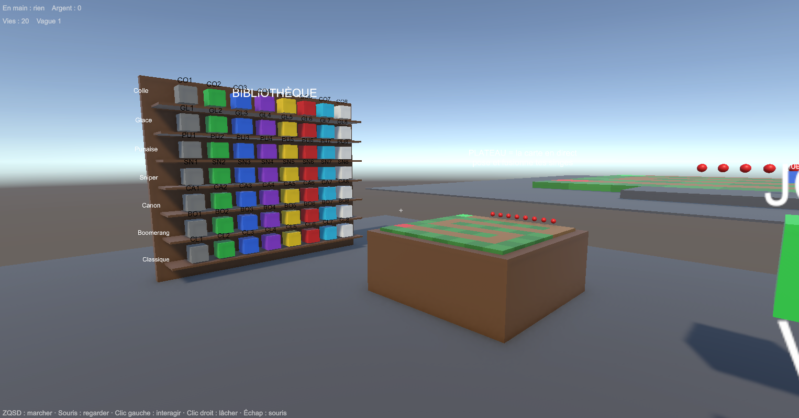

Le plateau, c'est la carte en direct : on y voit les ballons et les singes.

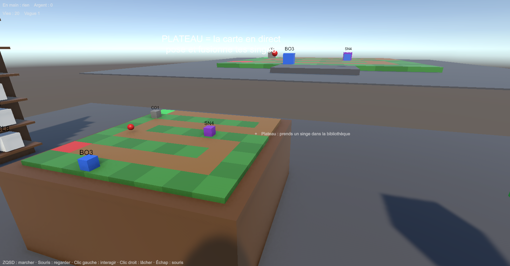

On pose un singe sur le plateau, avec un aperçu vert quand c'est possible.

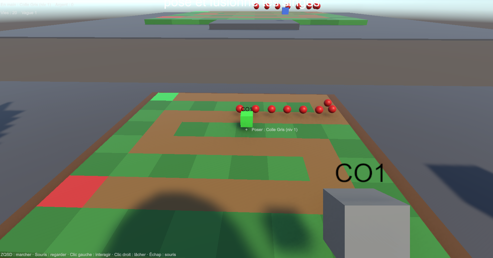

La carte, avec les singes posés depuis le hub.

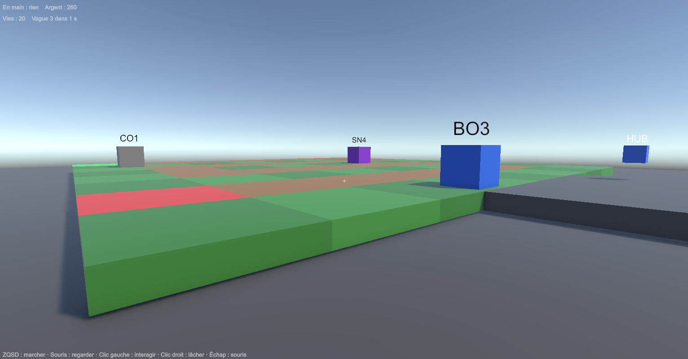

**Mon analyse critique du prototype v2** _(mon avis seul pour l'instant)_

- **Ce qui marche :** l'idée globale est la bonne. Le hub avec sa bibliothèque, le plateau qui montre la carte en direct, et la carte avec les singes posés depuis le hub, tout ça fonctionne ensemble.
- **Disposition pour la VR :** en VR, le joueur sera au centre, à son point d'apparition. Tous les éléments du hub doivent être **autour de lui**, inclinés vers lui et à portée de main. Aujourd'hui, ils sont alignés devant et sur les côtés, comme pour un écran.
- **La bibliothèque n'est pas utilisable :** 56 cubes (7 types × 8 raretés) avec leurs étiquettes, c'est trop d'informations d'un coup. On n'arrive pas à la lire. Il faut une autre solution.
- **Rendre la fusion visible :** quand on vise avec un singe en main un singe identique déjà posé, l'aperçu doit montrer qu'**on ne peut pas poser** à cet endroit. Un **halo blanc** autour du singe déjà posé doit indiquer qu'on peut **fusionner**. Aujourd'hui, l'aperçu devient simplement vert, et on ne distingue pas « poser » de « fusionner ».
- **Déplacer les singes sur la carte :** on doit pouvoir **prendre et déplacer** un singe directement quand on est sur la carte, pas seulement depuis le plateau du hub.

**Proposition alternative (testée, non retenue)** : hub en cercle autour du joueur, avec une bibliothèque réduite à 7 socles (un par type) et un sélecteur de rareté à 8 pastilles.
On garde de cet essai le plateau incliné, mais pas la bibliothèque : on revient à la bibliothèque en étagères (7 types × 8 raretés).

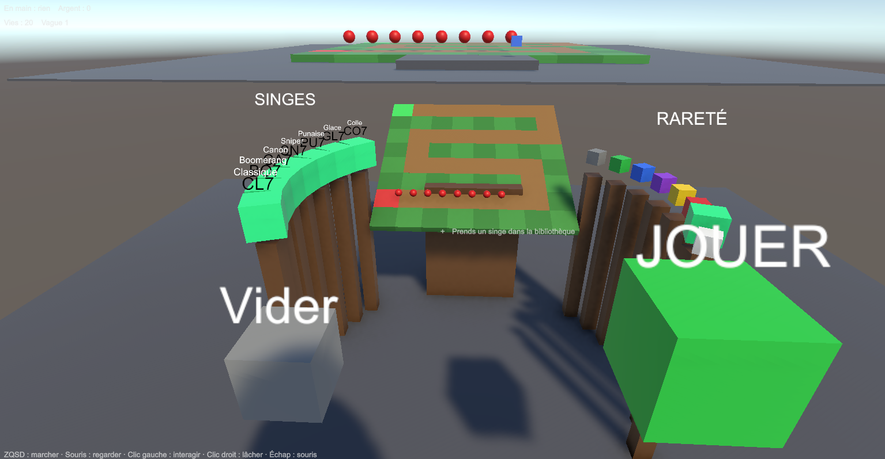

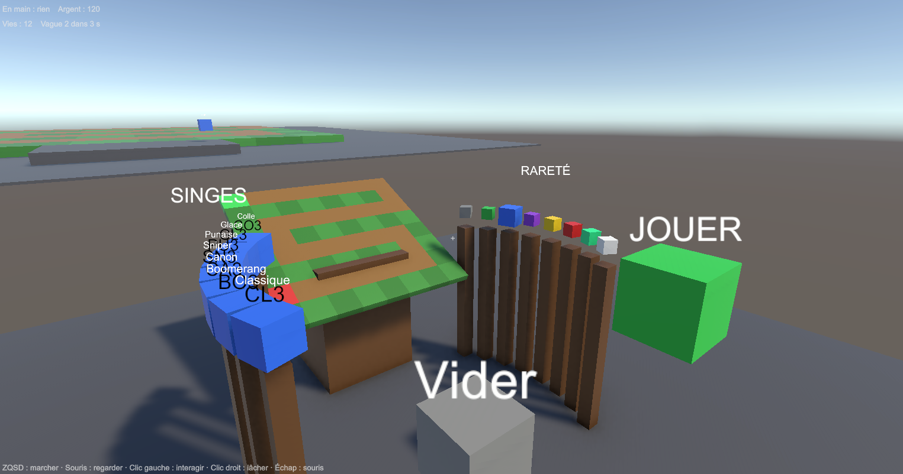

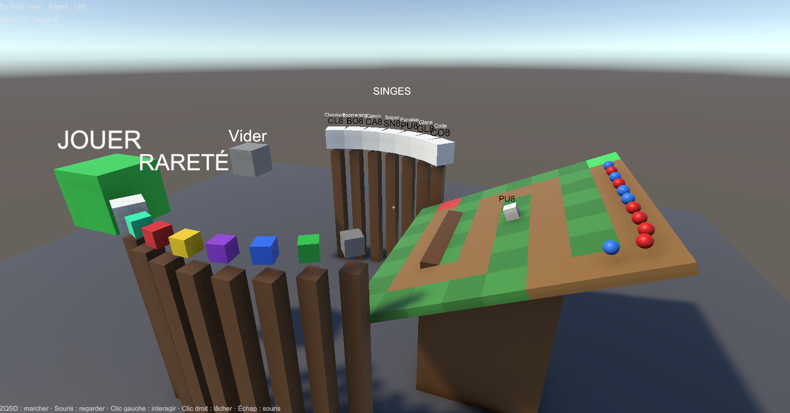

**Version actuelle (prototype v3)** : bibliothèque en deux meubles d'étagères (×1,1), plateau incliné posé sur une planche et un pied.

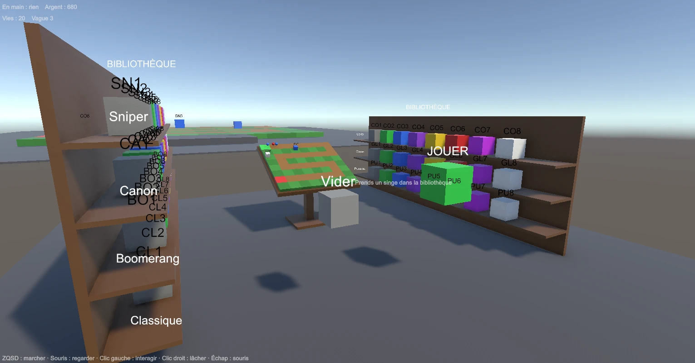

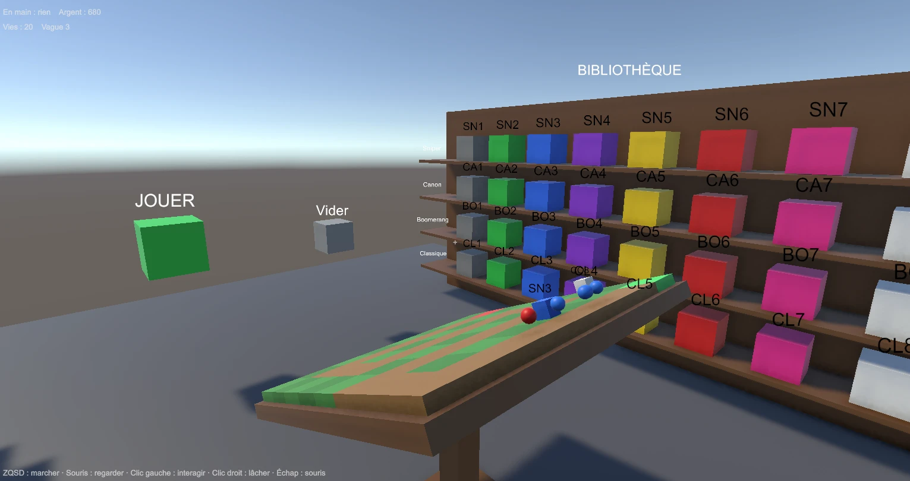

**Analyse des prototypes de mes camarades** _(mon avis)_

- **Nicolas (ouverture de coffres)** :
  - La roulette qui défile pour afficher la rareté gagnée est une bonne idée.
  - L'animation du coffre fait trop maladroite (« goofy ») : elle est à retravailler.
  - Je proposerais qu'une fois la rareté choisie par la roulette, **le singe sorte du coffre** avec la couleur de sa rareté. Ce serait plus satisfaisant et plus lisible.
- **Maxens (bananier)** : rien à redire. Le prototype est simple et efficace.

### IA
| Outil | Pour quoi | Gardé / jeté |
|---|---|---|
| Claude (Claude Code) | Résumé du support de lancement dans CLAUDE.md, squelette du dépôt (.gitignore Unity, LFS, README, modèles) | Gardé |
| Claude (Claude Code) | Règle « journal obligatoire » pour l'IA, création du dépôt GitHub | Gardé |
| Claude (Claude Code) | Analyse de l'idée TD Bloons par rapport aux consignes, GDD v0 (boucle, pourquoi la VR, périmètre proposé) | À valider en équipe |
| Claude (Claude Code) | Workflow Git (branches + PR), journaux général et par personne | Gardé |
| Claude (Claude Code) | Prototype clavier/souris (sans VR) : générateur de scènes Hub + Map, bibliothèque des 7 singes × 8 raretés, plateau 8×8 (poser / fusion 2→1 / échanger), piste en labyrinthe, vagues de ballons, singes qui tirent | À tester |
| Claude (Claude Code) | Prototype v2 : une seule scène (hub + carte), plateau = carte en miniature en direct (ballons, singes, joueur), placement libre hors piste, aperçu vert/rouge, téléportation | À tester |
| Claude (Claude Code) | Tags Unity (Ballon, Singe, Joueur, Plateau, Bibliotheque, Piste, Terrain, Bouton) créés automatiquement | Gardé |
| Claude (Claude Code) | Mode démo + build Windows pour captures d'écran | Jeté (retiré à ma demande) |
| Claude (Claude Code) | Ajout de mes captures du prototype dans mon compte rendu du jour | Gardé |
| Claude (Claude Code) | Reformulation de mon analyse critique (le fond est le mien) | Gardé |
| Claude (Claude Code) | Corrections suite à mon analyse : aperçu rouge + halo blanc pour la fusion, prendre/poser/fusionner directement sur la carte | Gardé |
| Claude (Claude Code) | Proposition alternative : hub en cercle, bibliothèque à 7 socles + sélecteur de rareté | Jeté (non retenu, voir captures) |
| Claude (Claude Code) | Retour à la bibliothèque en étagères ×1,1, en 2 meubles espacés (rangée la plus haute à 1,65 m) ; plateau incliné posé sur une planche + pied qui ne traverse plus | À tester |
| Claude (Claude Code) | Ajout de mes captures de la version actuelle (v3) | Gardé |
| Claude (Claude Code) | Préparation des projets de Nicolas et Maxens pour les tester (dossiers à part), mise en forme de mon analyse de leurs prototypes | Gardé |
| Claude (Claude Code) | Intégration des 3 prototypes sur `feat/integration` : merge des branches de Nicolas et Maxens, socle Unity 6000.6 gardé, packages glTFast / XR Toolkit / OpenXR ajoutés (le module VR ajouté aussi a été retiré : il n'existe plus en 6000.6), `.glb` en LFS ; package perso `unity-mcp` de Maxens non repris | À tester |
| Claude (Claude Code) | Ajout des retours de Maxens (envoyés sur Discord) dans son journal, à sa place | Gardé |
| Claude (Claude Code) | Hub en cercle autour du joueur : plateau plus grand (1,6 m) devant, bibliothèque à gauche et à droite, bananier + panier de Maxens derrière, coffre de Nicolas derrière à droite ; branchements : prendre les bananes, ouvrir le coffre (clic ou E), argent commun (bananes → coffre) | À tester |
| Claude (Claude Code) | Dossier `prompts/` (mes prompts reformulés et corrigés), règle « prompts » dans CLAUDE.md pour nous trois, README (rôles + journal commun du jour) | Gardé |
| Claude (Claude Code) | Un seul menu, « SAE » : menu « SAE501 » de Nicolas supprimé (packages déjà dans le projet, coffre monté par le hub), menus « Bananes » de Maxens retirés (son installeur reste utilisé par le hub) | Gardé |
| Claude (Claude Code) | Suppression des scènes de test de Nicolas et Maxens (`Sandbox/`) et des anciennes scènes `Hub.unity` / `Map.unity` (prototype v1) : il ne reste que `Jeu.unity` | Gardé |
| Claude (Claude Code) | Ajout de mes captures de l'intégration dans le journal général | Gardé |
| Claude (Claude Code) | Corrections du hub intégré : bibliothèques courbes qui suivent le cercle (lisibles depuis le centre, textes qui ne se chevauchent plus), coffre qui se tourne automatiquement vers le joueur, panier écarté du bananier | À tester |
| Claude (Claude Code) | Fusion de `feat/integration` dans `main` (PR #3), sans relecture de Maxens et Nicolas, à ma demande ; PR #2 fermée | Gardé |
| Claude (Claude Code) | Plan du mardi 6 oct. dans le journal général : points à harmoniser, chantiers A (économie), B (inventaire), D (vagues), E (VR) | Gardé |
