# Journal de bord — Maxens

_Entrée la plus récente en haut. Une entrée par jour travaillé. Toute aide de l'IA est notée ici (outil, pour quoi, gardé/jeté)._

## Mer. 7 oct. 2026
**Ma critique après la fusion** _(transmise à Dylan, mise en forme par l'IA ; issues #50 à #64)_
1. Un bouton assis / debout, ce serait sympa.
2. Quand on s'apprête à poser un singe, enlever son nom.
3. Une petite explication des touches (dont l'ajout des informations d'un singe en VR).
4. Enlever le saut en VR (inutile, on se téléporte).
5. Plus de bananes dans le coffre.
6. Améliorer le visuel de la fusion de deux singes : on voit un cercle rouge (on ne peut pas superposer, donc pas poser par-dessus), alors qu'on veut fusionner.
7. Améliorer certains objets et développer le décor global.
8. Sur la carte en taille réelle, les textes sont toujours au-dessus des singes.
9. On peut spammer avec l'arc : le rendre plus réaliste.
10. Améliorer et développer le décor extérieur (meilleures montagnes, champignons, etc.).
11. Améliorer la plateforme d'arrivée quand on se téléporte : elle est vide.
12. Rendre l'argent plus compréhensible (combien ça coûte, etc.).
13. Savoir combien de bananes on a quand on se téléporte.

- **À faire ce matin :** (1) le coffre : changer l'asset, améliorer l'animation, voir les singes en sortir ; (2) mettre les assets des ballons MOAB.
- **Fait : un nouveau coffre dans le style de la cabane** (branche `feat/coffre-maxens`, partie du `main` à jour avec la PR #9). L'ancien coffre téléchargé (`chest_cartoon_animations.glb`) ne collait pas à la direction artistique de la cabane.
  - modélisé par un script Blender, `Blender/coffre.py`, qui **reprend les textures et l'outil de `cabane.py`** (même bois à veines, même fer) : planches teintées une par une, montants de coin en bois sombre, deux bandes de fer avec rivets dorés, serrure dorée devant, poignées sur les côtés, couvercle bombé en lattes ;
  - **deux objets** : `Coffre_Caisse` et `Coffre_Couvercle`, dont l'origine est sur la charnière (arrière, en haut) : pour l'ouvrir, il suffit de le tourner autour de X (en négatif). Ça prépare l'animation ;
  - environ 1 100 triangles (léger pour le casque), exporté en `Art/Coffre/Coffre.glb` ;
  - **pas encore branché dans la scène** : le jeu utilise toujours l'ancien coffre et son animation ; on remplacera les deux en même temps (étape suivante : l'animation).
  - À reprendre : l'intérieur de la caisse est plein (on voit le dessus des planches quand il est ouvert) ; à creuser au moment de l'animation, pour voir les singes sortir.

  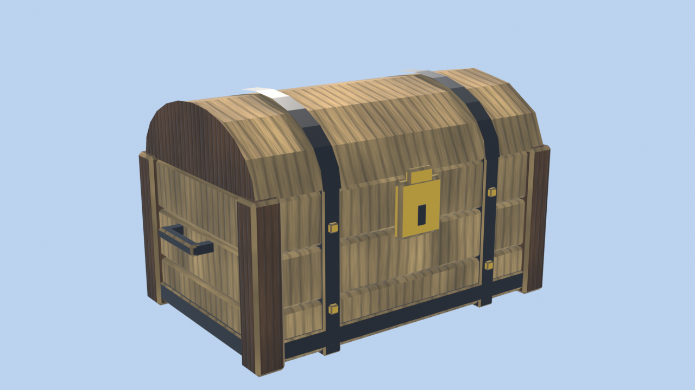

  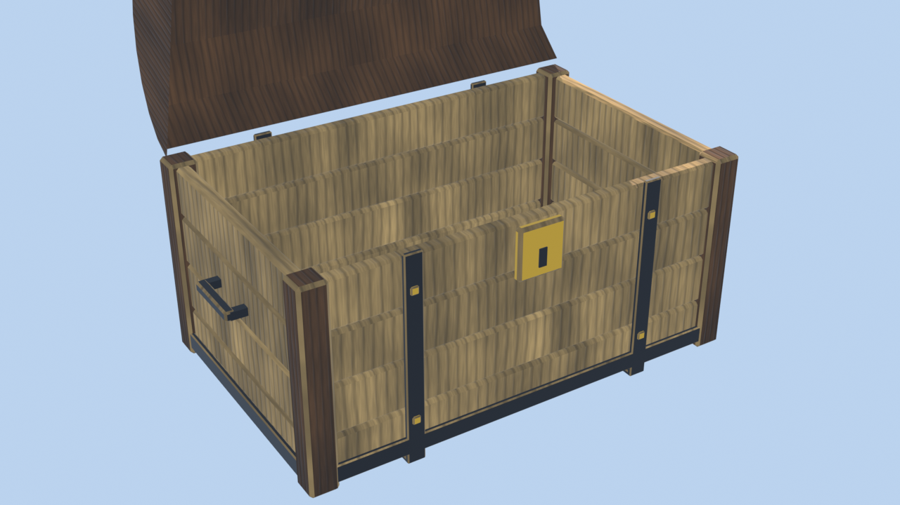

- **Fait : le nouveau coffre dans le jeu, avec son ouverture et la roulette des singes** :
  - le coffre de la cabane remplace l'ancien dans la scène ; **il ne tourne plus vers le joueur**, il reste fixe sur son estrade ;
  - **à l'ouverture** (nouveau script `Hub/ChestLid.cs`) : un petit **« boing »** (le coffre s'écrase puis rebondit), **le couvercle s'ouvre** en tournant sur sa charnière, et **une aura dorée** s'allume (la même aura en flammes que les singes, en or : `Aura.Add` accepte maintenant une couleur). Il se referme quand la roulette disparaît ;
  - **la roulette montre de vrais singes avec l'aura de leur rareté** à la place des carrés de couleur (fond de case de la couleur de la rareté, assombri) ;
  - **le singe au centre est bien celui qu'on gagne** : le type du singe est maintenant tiré par le coffre en même temps que la rareté, avant la roulette (avant, il était tiré après, par `ChestReward`) ;
  - pour le casque : seuls les singes qui passent dans la fenêtre de la roulette sont allumés (environ 7 sur 48).
  - Testé en Play (en ouvrant le coffre par code) : boing, couvercle, aura dorée, roulette qui s'arrête sur un singe Glace violet, puis ce même singe qui sort du coffre. Aucune erreur.

  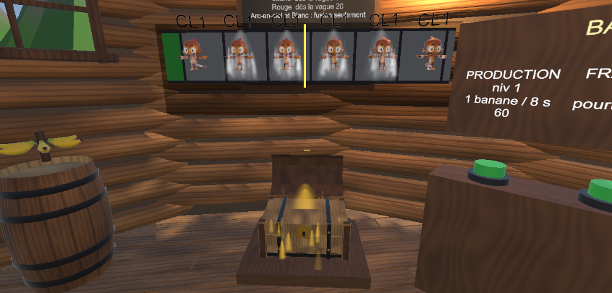

  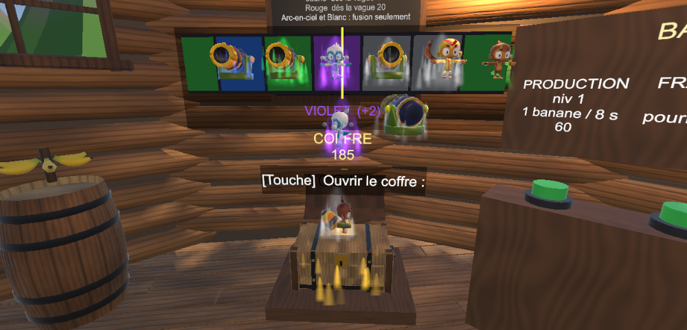

- **Corrigé après mon test :**
  - **le coffre était trop petit** : il fait maintenant 1,1 m de large (au lieu de 0,8), sur une estrade plus grande ;
  - **il paraissait fermé et ouvert en même temps** : la caisse était pleine, et le dessus des planches ressemblait à un deuxième couvercle fermé. **La caisse est maintenant creuse** (4 parois en planches, un fond sombre) et les bandes de fer sont de simples cerclages à l'extérieur ;
  - **3 singes sortaient du coffre** : le code donnait 1 singe de plus toutes les 3 vagues gagnées (et mon test avait mis « 8 vagues gagnées », restées en mémoire dans Unity). **Ce n'était pas la règle voulue** : un coffre donne **toujours un seul singe** ; ce qui monte avec les vagues, ce sont **ses chances d'être rare** (à 0 vague : 64 % gris, 36 % vert ; à 9 vagues : du bleu et du violet apparaissent). Corrigé dans `ChestController` (`MonkeysPerChest = 1`), et le panneau des chances n'affiche plus « Singes : X ».

  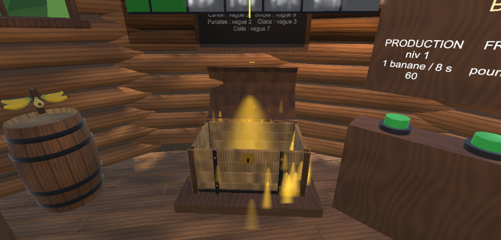

- **Fait : un trésor dans le coffre et un coffre qui appelle le joueur** :
  - ~~3 régimes de bananes~~ remplacés ensuite (voir plus bas) par les bananes du bananier sur un lit de feuilles ;
  - **quand on a assez d'argent pour l'ouvrir**, le coffre **se trémousse** toutes les 2,5 s (il se balance de gauche à droite, de moins en moins, jusqu'à 4°), pour inviter le joueur à l'ouvrir. Il s'arrête quand il est ouvert ou si on n'a plus assez d'argent (`ChestLid`).
  - Testé en Play : le coffre penche bien pendant l'appel (3,5° mesurés), et les bananes sont visibles une fois ouvert.

- **Corrigé après mon test (roulette, sortie du singe, textes, trésor)** :
  - **la roulette ne montrait que le singe de base** : les autres cases montrent maintenant **tous les types** (Canon, Tireur, Glace, Sniper…), pour le spectacle. La case gagnante reste le vrai tirage, qui suit la règle de Dylan : les types se débloquent avec les vagues (au début, on gagne seulement des Classiques) ;
  - **ça défile très vite au début** puis ralentit : 100 cases au lieu de 48 sur la même durée. Pour le casque, seuls les singes visibles dans la fenêtre existent (créés quand leur case entre, détruits quand elle sort) ;
  - **quand le singe est choisi, la barre jaune s'en va** ;
  - **le singe sort du milieu du coffre** : il part petit (30 %), monte d'1 m en tournant et en grossissant, flotte, puis vole jusqu'à sa case de la bibliothèque (plus de texte « CL1 » au-dessus) ;
  - **plus de texte quand le coffre est ouvert** : « [Touche] Ouvrir le coffre » et le prix disparaissent tant qu'il est ouvert ;
  - **le trésor** : les **bananes du bananier** (celles qui tombent de l'arbre) posées sur un **lit de feuilles de bananier**, sur un double fond assez haut pour être bien vu (feuilles ajoutées dans `Blender/coffre.py`, bananes posées par le générateur). Les régimes de la cabane sont retirés.
  - Testé en Play : défilement de tous les types, barre qui disparaît, singe gagné qui sort du coffre en grossissant, consigne cachée. Aucune erreur.

  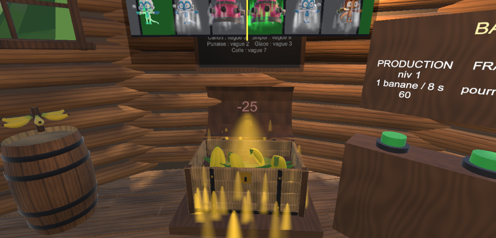

  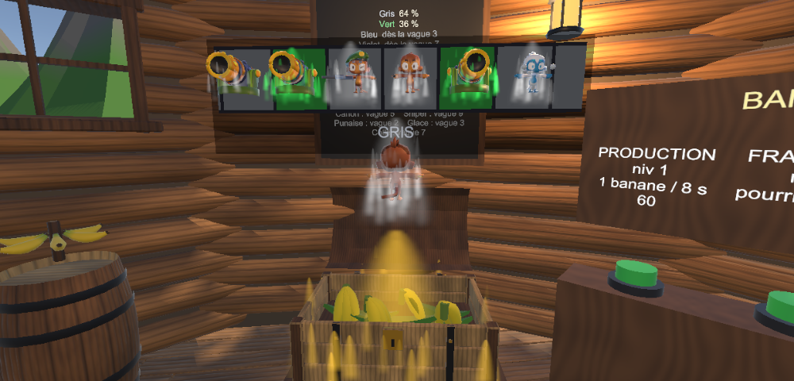

- **Retiré : l'aura dorée du coffre** (elle ne rendait pas bien). À l'ouverture, il reste le boing et le couvercle qui s'ouvre.

- **Fait : les modèles 3D des ballons et des boss dans le jeu** (branche `feat/coffre-maxens`, à jour avec le `main` de la PR #11). Mes modèles étaient déjà dans `Art/` (`Ballons`, `MOAB`, `BFB`) mais **aucun script ne les utilisait** : les ballons étaient des sphères et le dirigeable une capsule.
  - chaque sorte a son modèle : **normal et rapide** = `Ballon_Normal` (teinté à la couleur de sa couche), **blindé** = `Ballon_Blindage`, **boss** = `MOAB` (bleu), **dirigeable rouge** = `BFB` ; branchés comme les singes, par un asset `Resources/BalloonVisuals.asset` et le menu `SAE → Brancher les modèles des ballons` ;
  - **plus de sphère** : le ballon est son modèle, avec un collider invisible ajusté à sa taille (les flèches en ont besoin pour le toucher). La miniature du plateau du hub montre aussi le vrai modèle ;
  - **le MOAB était blanc** : les FBX pointaient vers des textures d'un autre ordinateur (`/home/claude/…`), Unity les importait sans texture. Le code pose maintenant la bonne texture lui-même, sur le ballon et sur sa miniature ;
  - **les hélices tournent** (nouveau script `Spinner`) : une pour le MOAB, deux pour le BFB, autour du grand axe du dirigeable ;
  - **les dirigeables tournent en douceur** dans les virages (60° par seconde) au lieu de pivoter d'un coup ;
  - **nouveau ballon cœur** (règle du GDD : il se régénère) : modèle `Ballon_Coeur` en rose, il regagne **1 couche toutes les 2 s**, sans dépasser ses couches de départ. Affiché sur le tableau des vagues (« 1 cœurs ») ;
  - **la vague 1 montre un exemple de chaque** : 1 normal, 1 cœur, 1 blindé, puis les 8 normaux, le MOAB et un **BFB d'aperçu à 20 couches** (au lieu de 150). Modifiée aussi dans `Jeu.unity`, qui garde sa propre copie des vagues ;
  - **le joueur traverse les ballons et les boss** sur la carte (les flèches les touchent toujours).
  - Testé en Play via Unity MCP : les 5 sortes apparaissent avec leur texture, hélices branchées (1 sur le MOAB, 2 sur le BFB), aucune erreur.

  Avant : le MOAB arrivait tout blanc, et son hélice ne tournait pas.

  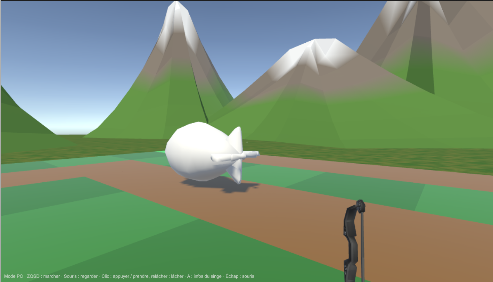

  Après : normal, cœur, blindé, MOAB et BFB avec leurs textures.

  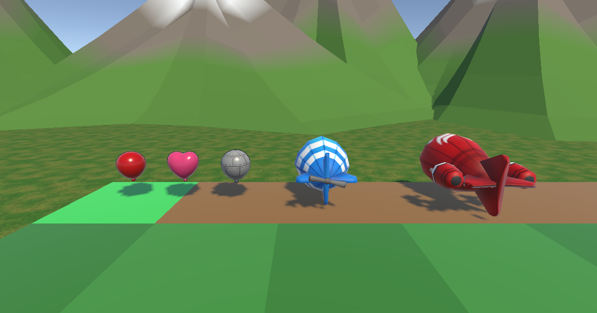

### IA
| Outil | Pour quoi | Gardé / jeté |
|---|---|---|
| Claude (Code) | Modèles 3D des ballons, du MOAB et du BFB à la place des sphères (collider ajusté, miniature du plateau), textures posées par le code, hélices qui tournent, virages en douceur ; testé en Play via Unity MCP | Gardé |
| Claude (Code) | Ballon cœur qui se régénère, vague 1 avec un exemple de chaque ballon et un BFB d'aperçu, joueur qui traverse les ballons | À tester au casque |
| Claude (Code) | Retrait de l'aura dorée du coffre | Gardé |
| Claude (Code) | Roulette avec tous les types et très rapide au début, barre qui disparaît, singe qui sort du coffre en tournant et grossissant, textes cachés à l'ouverture, bananes du bananier sur des feuilles ; testé en Play | À tester au casque |
| Claude (Code) | Régimes de bananes dans le coffre, coffre qui se trémousse quand on peut l'ouvrir ; testé en Play | Trémoussement gardé, régimes jetés (remplacés par les bananes du bananier) |
| Claude (Code) | Coffre agrandi (1,1 m) et creusé (on voit l'intérieur à l'ouverture), cerclages de fer à l'extérieur ; un seul singe par coffre (seules les chances de rareté montent avec les vagues) | À tester au casque |
| Claude (Code) | Nouveau coffre branché dans la scène (fixe), ouverture boing + couvercle + aura dorée (`ChestLid`), roulette avec les vrais singes et leur aura, type du singe tiré avant la roulette ; testé en Play | À tester au casque |
| Claude (Code) | Nouveau coffre modélisé par script Blender (`coffre.py`) dans le style de la cabane, couvercle séparé sur sa charnière, rendus d'aperçu | À valider |

**Mon analyse critique du hub et de la carte** _(transmise à Dylan, qui corrige sur la branche `fix-all` ; mise en forme par l'IA)_
1. **Bibliothèque :** le mot « Bibliothèque » nous regarde (il tourne vers le joueur) ; les textes sont trop simples, un peu moches. Les singes sont en T-pose : à changer peut-être.
2. **Récolteur :** même remarque sur les textes ; je n'aime pas les boutons jaunes. Le meuble devrait disparaître quand tout est au maximum (la colonne disparaît). Idée : quand tout est à fond, un mini-jeu en plus apparaît à la place, par exemple une roulette.
3. **Bananier :** à refaire, et toute sa zone aussi ; essayer de faire autrement, je ne sais pas encore comment.
4. **Boutons LANCER et JOUER :** horribles. Les caisses à côté rentrent dans l'armoire. Je ne suis pas fan du tonneau. Améliorations du bananier : pareil que le récolteur, les faire disparaître une fois au maximum et mettre autre chose à la place.
5. **Carte :** rien n'est beau, tout est à refaire, montagnes comprises.

## Mar. 6 oct. 2026
- **Fait :** nouvelle branche `feat/prototype-maxens`, créée depuis le `main` à jour (PR #7 incluse), pour faire mes tests : placer le bananier dans la scène, essayer des réglages, etc.
- **Fait :** tous mes modèles 3D ajoutés au projet Unity sur cette branche, dans `Unity/Assets/_Project/Art/<Nom>/` (`FBX/` + `Textures/`) : Ballons (normal, blindé, cœur), BFB, MOAB, Boomerang, Canon, Colle, Glace, Pat Fusty (FBX + `Pat_Fusty.glb`), Quincy (niv. 3, 7, 10, 20 + flèche), Singe de base (+ fléchette), Sniper, Tireur (+ punaise).
- **Fait :** le bananier passe à la version **grand tronc** (`Bananier.fbx` remplacé, mêmes noms d'objets, donc les scripts et la scène marchent toujours). La branche locale `art/bananier-grand-tronc` n'est plus utile.
- **Pas mis dans Unity :** les `.blend` (Unity essaierait de les ouvrir avec Blender), les dossiers `Source/` et `Ancien/`, les images d'aperçu et les scripts du Tireur (à reprendre à part si besoin).
- **Fait :** `.meta` des modèles créés par Unity et commités.
- **Fait :** les **vrais singes dans la bibliothèque** (et partout où un singe s'affiche : sortie du coffre, singe en main, aperçu de pose, carte) à la place des cubes de couleur :
  - un type = un modèle : Classique → Singe de base, Boomerang, Canon, Sniper, Punaise → Tireur, Glace, Colle. Les modèles sont rangés dans `Resources/MonkeyVisuals.asset`, rempli par le menu **SAE → Brancher les modèles des singes** ;
  - la rareté n'est plus la couleur du cube mais une **aura « à la Dragon Ball »** : des flammes de la couleur de la rareté qui montent autour du singe et se resserrent en pointe, plus une lueur douce (arc-en-ciel = flammes de toutes les couleurs). C'est un **prefab** (`Prefabs/Aura.prefab`, deux systèmes de particules « Flammes » et « Lueur ») qu'on règle dans l'Inspector ; le script `Core/Aura.cs` ne fait que le colorer et l'adapter à la taille du singe ;
  - case vide de la bibliothèque : le singe est sombre, plus petit et sans aura ; le nombre possédé est écrit devant lui ;
- **Testé** dans l'éditeur (Play) : bibliothèque remplie, singe en main, singe posé sur la carte, aucune erreur dans la console. Les singes riggés étaient exportés de dos : ils sont retournés de 180° (réglage par modèle dans `MonkeyVisuals`).
- **Corrigé après mon test :**
  - le singe posé sur le **plateau du hub** apparaissait en cube : la miniature est maintenant le vrai singe en petit, avec son aura ;
  - l'aura du **Canon** et du **Tireur** (objets larges et bas) était cachée par le modèle : les flammes partent maintenant du bord de l'objet, quelle que soit sa forme ;
  - le **Canon** était tourné vers le mur : il est retourné vers le joueur ;
  - hors Play, la bibliothèque repassait en **cubes** : la scène gardait les cubes enregistrés, et les singes 3D n'étaient construits qu'au lancement. Nouveau menu **SAE → Mettre à jour les singes de la bibliothèque**, lancé puis scène `Jeu.unity` enregistrée **sur ma branche** (accord : la scène est à Dylan, à voir avec lui au moment de fusionner). Hors Play on voit les modèles sans l'aura : les particules enregistrées dans la scène la faisaient passer de 1,3 à 7,6 Mo, donc l'aura n'est créée qu'en jeu. Les modèles sont enregistrés comme liens vers les FBX (sinon 9 Mo) ; la scène fait 1,5 Mo.

- **Relu avec les cours de D. Di Pierro** (les PDF des supports 2, 3, 4 et le TP 1, plus `docs/GUIDE_CODE.md`), et code repris pour suivre leurs exemples :
  - l'aura était construite entièrement en code, avec beaucoup de nombres en dur : elle devient un **prefab** réglé dans l'Inspector, comme le pistolet et sa balle du support 4 ;
  - plus de recherche de composants à chaque frame : l'aperçu de pose teintait le modèle en cherchant ses renderers à chaque image, ils sont maintenant gardés en mémoire (guide, section 4) ;
  - les derniers nombres en dur ont un nom (`WidthWeight`, `MinRadius`) ;
  - corrigé au passage : sur la carte et le plateau, l'aura apparaissait d'abord blanche (le prefab démarrait avant de recevoir sa couleur).
  Retesté en Play (bibliothèque, singe en main, carte, plateau du hub) : aucune erreur dans la console.

- **Fait : test d'un hub « sans bouger »** (d'après mon schéma) :
  - au hub, le joueur reste **au centre** et fait tout en tournant la tête et en prenant les objets de loin : plus de déplacement au hub (ZQSD coupé), on marche toujours sur la carte. C'est le point d'arrivée qui le dit (`SpawnPoint.canWalk`) ;
  - tout est rapproché en rond autour du joueur (cercle de 3,5 m au lieu de 5 m) : le plateau devant, JOUER à droite, LANCER et Vider à gauche, les deux bibliothèques sur les côtés, le coffre et le panneau d'amélioration derrière à gauche, le bananier, son panier et la caisse derrière à droite ;
  - la zone de chute des bananes est un long tapis jaune qui part du pied du bananier et descend vers le joueur : les bananes arrivent à portée ;
  - portée plus longue : 6 m pour prendre les bananes et pour ouvrir le coffre depuis le centre ;
  - **plateau plus grand** : 2,4 m au lieu de 1,6 m, pour bien reconnaître chaque singe posé ;
  - **plus de texte au-dessus des singes** (carte, plateau, main, coffre) : le modèle dit le type, l'aura dit la rareté.
  Scène `Jeu.unity` régénérée avec le menu **SAE → Générer le prototype** (sur ma branche). Testé en Play : on ne peut pas marcher au hub, le coffre s'ouvre de loin, les bananes tombent sur le tapis, aucune erreur.
- **Confort VR :** rester au centre sans se déplacer, c'est le plus confortable (aucune locomotion, donc aucun risque de nausée). En revanche, prendre « de loin » demandera un rayon (Ray Interactor, support 5) au casque, pas seulement les mains.

Mon schéma du hub (le joueur au centre, tout à portée du regard) :

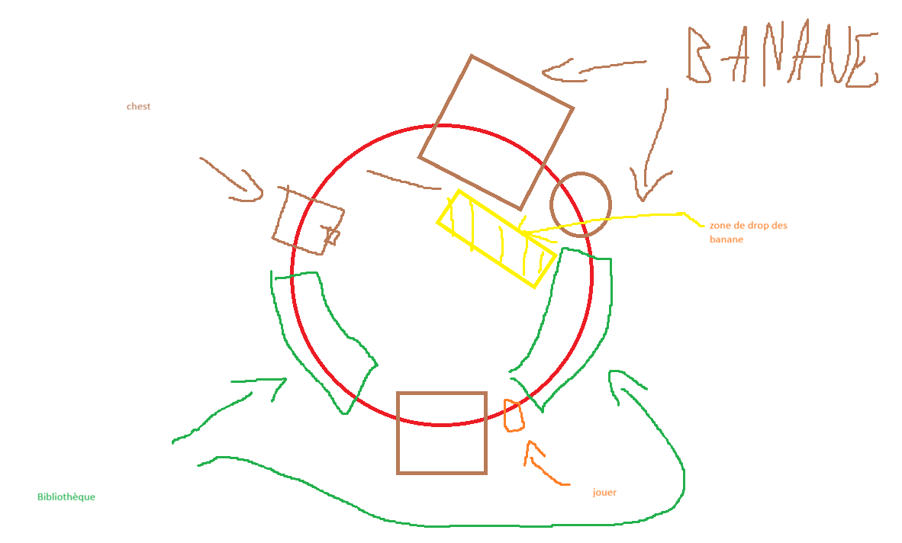

- **Analyse du rig de Quincy** (notre personnage, avec l'arc comme arme) : fichiers `Art/Quincy/FBX/QuincyLvl3/7/10/20_Rigged.fbx`, analysés dans Unity sans rien modifier.
  - **Ce qui est bien fait :**
    - un seul squelette de 28 os, le même pour les 4 niveaux : les mêmes animations serviront pour tous ;
    - des noms d'os standards (Hips, Spine, Neck, Head, LeftArm, LeftForeArm, LeftHand, LeftUpLeg…) : Unity peut les reconnaître en « Humanoid » pour réutiliser des animations toutes faites ;
    - bras, jambes et queue ont des poids progressifs entre les os (ils plient proprement), et les coudes et poignets sont bien placés ;
    - la flèche chargée (`LoadedArrow`) est déjà un objet à part, et l'arc est fait de morceaux de maillage séparés (corps de l'arc, deux pointes, corde) : il sera facile à détacher.
  - **Ce qui bloque pour un arc utilisable :**
    1. l'arc n'est pas séparé du personnage : il est dans le même maillage que Quincy et collé à 100 % à l'os `RightHand`. On ne peut donc pas le prendre, le bouger ou le viser indépendamment de la main ;
    2. l'arc n'a aucun os : la corde est un simple trait droit, impossible à tendre ;
    3. la flèche (`ArrowSocket`) est accrochée à la main droite, la même que l'arc, alors qu'elle doit suivre la main qui tire la corde ;
    4. 19 sommets du corps (vers la main droite) dépendent en partie de l'os `ArrowSocket` : si on bouge la flèche, la main se déforme ;
    5. pas d'os de doigts (une main = un seul os) : la main ne peut pas se refermer sur l'arc ni pincer la corde ;
    6. bras asymétriques : avant-bras droit de 0,235 m contre 0,14 m à gauche (le bras droit est allongé pour tenir l'arc). À vérifier si on passe en Humanoid ;
    7. importé en « Generic », sans animation dans les fichiers.
  - **Vérifié aussi dans Blender** (`Quincy_Rig.blend`, ouvert en lecture seule) : même constat, avec trois précisions :
    - les os `ArrowSocket` et `ArrowTip` sont cochés « Deform » : c'est ce qui leur donne des poids sur le corps, alors que ce ne devraient être que des points d'accroche ;
    - l'os `RightHand` mesure 0,27 m, presque le double de `LeftHand` (0,15 m) : il traverse la poignée de l'arc ;
    - le fichier contient 4 squelettes identiques (un par niveau) et aucune animation.
  - **À faire dans Blender** (`Quincy_Rig.blend`) avant de l'utiliser comme arme :
    - séparer l'arc (corps, pointes, corde) dans son propre objet et l'exporter à part (`Quincy_Bow.fbx`) ;
    - lui donner son propre petit squelette : poignée, branche haute, branche basse, et un os au milieu de la corde (point d'encoche) ; la corde en deux segments qui se rejoignent à ce point, pour pouvoir la tirer ;
    - décocher « Deform » sur `ArrowSocket` et `ArrowTip`, retirer leurs poids sur le corps, et mettre à la place des points d'accroche vides : un pour l'arc dans la main qui le tient, un pour la flèche dans la main qui tire ;
    - si les mains de Quincy sont visibles au casque : ajouter des os de doigts.
- **Fait : l'arc de Quincy est séparé du personnage** (script Blender lancé sur une **copie** du fichier : `Quincy_Rig_ArcSepare.blend`, l'original `Quincy_Rig.blend` n'est pas modifié ; le script est rangé à côté, `separer_arc.py`) :
  - pour les 4 niveaux, l'arc (corps, pointes, corde : 152 sommets) sort du maillage du singe : bras et mains sont maintenant seuls dans le maillage du personnage ;
  - **nouvel objet `Quincy_Bow.fbx`** avec son propre squelette : `Grip` (poignée, le point à saisir), `LimbTop` et `LimbBottom` (les branches), `String` (le milieu de la corde). La corde est droite au repos et **se tend en tirant l'os `String`** (testé : 15 à 20 cm de recul donnent le V de la corde) ;
  - les os de la flèche (`ArrowSocket`, `ArrowTip`) ne déforment plus le corps : ce sont des points d'accroche, et la flèche chargée y est accrochée comme un objet enfant ;
  - nouveau point d'accroche **`BowGrip`** dans la main droite : en Unity, on pose l'arc dessus (poignée sur poignée) et il tombe exactement à sa place d'origine ;
  - les 4 FBX du singe sont remplacés dans `Art/Quincy/FBX/`, et un matériau `Quincy_Mat` (avec la texture de Quincy) est branché sur tous les modèles de Quincy : ils étaient blancs après le nouvel export.
  - **Reste à faire :** les branches de l'arc ne plient pas encore quand on tire (on pourra tourner `LimbTop` / `LimbBottom`), la flèche chargée est toujours dans la main de l'arc (en VR, elle suivra la main qui tire, gérée par le jeu), et seul l'arc du niveau 3 est exporté (celui du niveau 20 est un peu plus grand).

  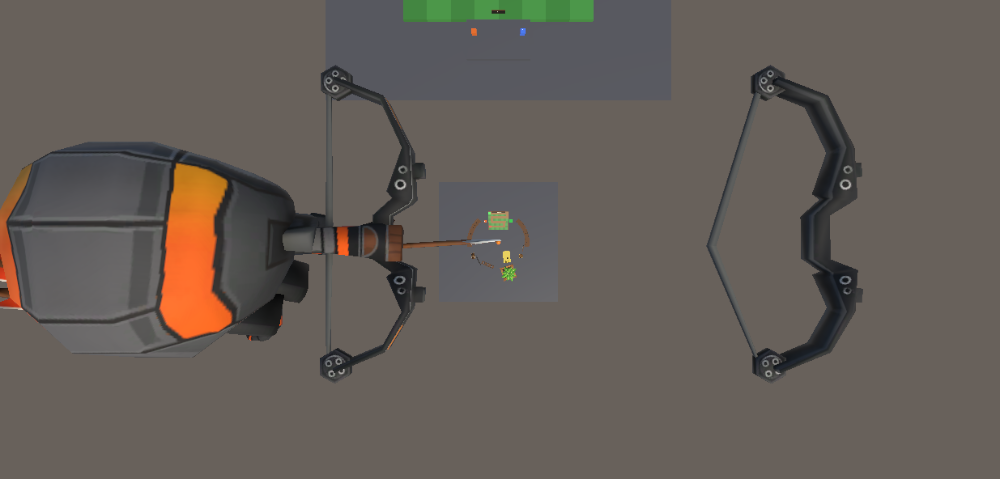

- **Bilan de l'arme (état final du jour, branche `feat/arc-quincy`)** — le détail de chaque étape suit en dessous :
  - **au hub, on n'a que les mains de Quincy** (gants simples, dos de la main vers le haut, inclinés pouce relevé) ; elles se ferment avec le grip et la gâchette ; le singe pris est tenu devant la main ;
  - **sur la carte, l'arc apparaît dans la main gauche**, tenu sur le côté ; on approche la main droite de la corde, on serre, une flèche s'encoche et la main droite reste accrochée à la corde ; on recule la main pour tendre (sans casque, la tension monte en gardant le bouton), on relâche : la flèche part, vole avec la gravité et éclate les ballons ;
  - **en mode PC** : clic droit maintenu puis relâché ;
  - testé dans le simulateur VR et en Play ; **reste à tester au vrai casque** (taille de l'arc bras tendu, confort de visée, prise des singes).

  Mes captures dans le simulateur VR : la flèche encochée, mains de Quincy sur l'arc et la corde ; puis les mains au hub, inclinées.

  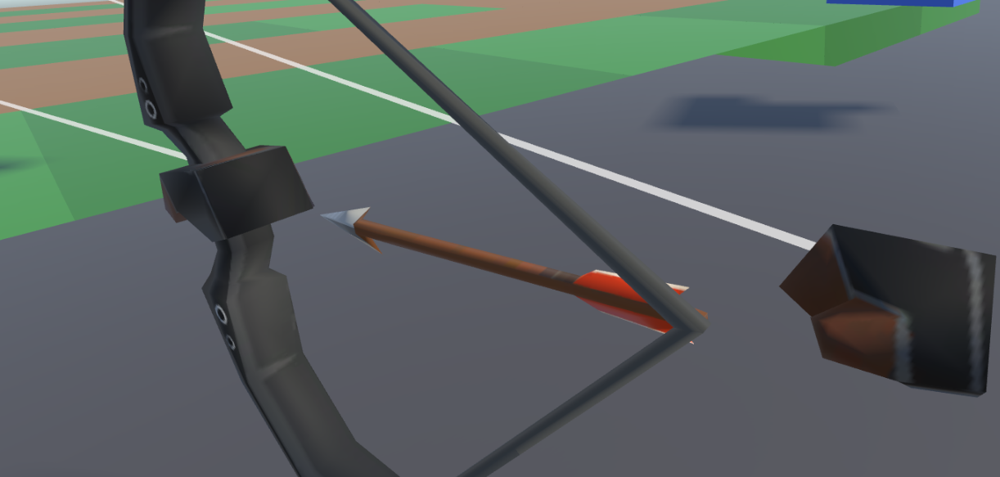

  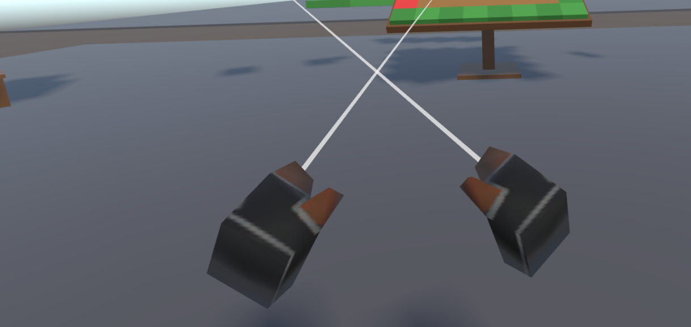

- **Fait : le système de l'arc** (branche `feat/arc-quincy`, partie du `main` à jour avec la PR #8, arc séparé de Quincy repris de `feat/prototype-maxens`) :
  - **au hub, seulement les mains** ; l'arc apparaît dans les mains quand on se téléporte sur la carte (bouton JOUER) et se range au retour (`BowHolster`, qui réagit au nouvel événement `PlayerRig.Teleported`) ;
  - **au casque** (`VRArcher`) : l'arc est dans la main gauche ; on approche la main droite de la corde et on serre le grip : une flèche s'encoche ; on recule la main pour tendre, on relâche pour tirer. Vibrations à l'encoche, pendant la tension et au tir ;
  - **en mode PC** (`DesktopArcher`) : clic droit maintenu pour tendre (1 s pour la tension maximale), relâcher pour tirer vers le viseur ;
  - **l'animation** (`Bow`) : la corde recule (jusqu'à 50 cm), les branches plient vers l'archer, la flèche suit la corde ; au lâcher, elle part d'autant plus vite que l'arc était tendu (8 à 30 m/s) ;
  - **la flèche** (`Arrow`) : elle vole avec la gravité en s'orientant dans le sens de sa course (elle pique du nez), éclate jusqu'à 3 ballons (2 dégâts chacun), se plante dans le reste, puis disparaît ;
  - prefabs `Prefabs/Arc.prefab` et `Prefabs/Fleche.prefab`, fabriqués par le menu **SAE → Préparer l'arc** (appelé par le générateur de scène) ; scène `Jeu.unity` régénérée.
  - **Testé en Play** (sans casque, en commandant l'arc par code) : arc caché au hub et visible sur la carte, corde tendue en V avec la flèche encochée, branches qui plient du bon côté, flèche qui vole pointe devant, ballon touché (3 → 1 point de vie). Aucune erreur dans la console.
  - **À tester au casque :** le geste réel (main droite sur la corde), la taille de l'arc (environ 1 m), et le confort de la visée. Le tir au clic droit en mode PC n'a pas encore été essayé à la main.

  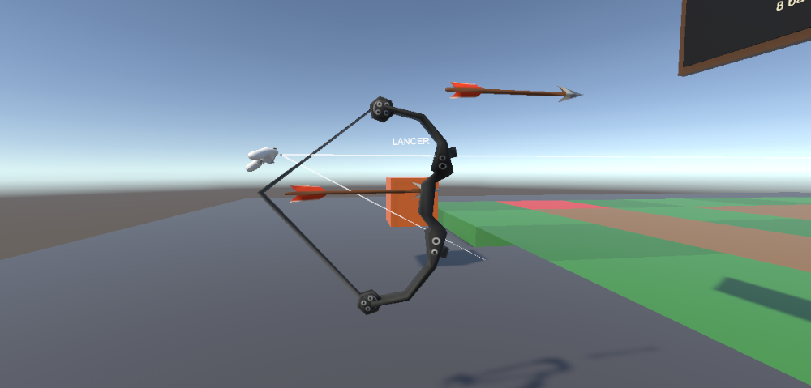

- **Corrigé après mon test au casque (simulateur) :** l'arc était trop gros et je n'arrivais pas à tirer.
  - l'arc passe de 1 m à environ **65 cm** (et la flèche de 81 à 60 cm), la corde recule de 40 cm au maximum ;
  - attraper la corde est beaucoup plus facile : la main droite peut être **jusqu'à 40 cm** de la corde (au lieu de 15), et **la gâchette marche aussi**, en plus du grip ;
  - **dans le simulateur sans casque** : `]` pour piloter la manette droite, `` ` `` pour choisir l'action rapide « Grip », `Espace` pour serrer / relâcher, `S` pour reculer la main pendant que la corde est tenue.
- **Fait : les mains de Quincy à la place des manettes**, au hub comme sur la carte :
  - la main gauche de Quincy est sortie du personnage dans Blender (script `creer_mains.py`, sur une nouvelle copie `Quincy_Mains.blend`) et **riggée** : poignet, paume, doigts, pouce (avant, une main = un seul os, impossible à fermer). Le trou au poignet est bouché ;
  - la main droite est la même, en miroir. Prefabs `Main_Gauche` / `Main_Droite` (menu **SAE → Préparer les mains**), posés sur les manettes ; les manettes blanches des Starter Assets sont cachées ;
  - nouveau script `AnimateHandOnInput` (le même principe que dans le support 3 du cours) : le grip ferme les doigts, la gâchette plie le pouce ; la main gauche reste fermée sur l'arc tant qu'il est sorti.
  - Testé en Play : mains visibles et bien orientées (doigts devant, pouce en haut), main gauche refermée sur la poignée de l'arc, aucune erreur de notre code.
  - **À voir au casque :** la position de la main sur la manette (réglage `HandOffset` dans le générateur) et la taille des gants (environ 18 cm).
  - Pas commité : les réglages OpenXR réécrits tout seuls par le package Meta à l'ouverture (réglages VR de l'équipe).

  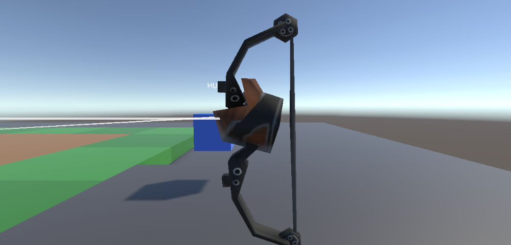

- **Refait après mon test : les mains se fermaient bizarrement** (le gant de Quincy n'avait que 2 gros blocs, doigts et pouce, qui se cassaient en se pliant, et il était énorme vu de près), et **le singe pris se retrouvait dans la main** :
  - **nouvelles mains modélisées dans Blender par script** (`creer_mains.py`, fichier `Quincy_Mains.blend`), dans le style de Quincy : gant noir, bouts des doigts bruns, manchette orange, environ 18 cm. **4 doigts à 2 phalanges + un pouce à 2 phalanges**, chaque morceau suivant un seul os : ils plient comme de vraies articulations. Une main gauche et une main droite exportées (`Quincy_Main_Gauche.fbx`, `Quincy_Main_Droite.fbx`), 288 sommets chacune ;
  - `AnimateHandOnInput` plie maintenant chaque phalange vers la paume : grip = poing fermé, gâchette = pouce plié ;
  - **le singe pris est tenu à 12 cm devant la main** (point de prise du XR Grab décalé dans `MonkeyToken`), plus dedans ;
  - l'ancienne main découpée dans le personnage (`Quincy_Main.fbx`) est supprimée.
  - Testé en Play : mains visibles et bien orientées, poing fermé propre, point de prise présent sur les singes. La prise réelle d'un singe reste à voir au casque.

  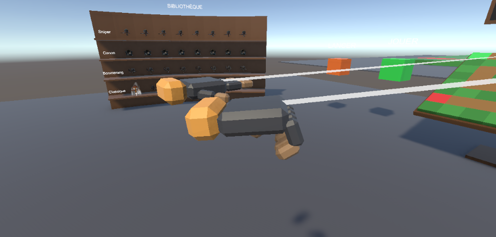

- **Annulé : les mains détaillées** ne collent pas au style du jeu (trop « réalistes » à côté des modèles simples). **Retour à la main simple découpée dans Quincy** (`Quincy_Main.fbx`), en gardant le singe tenu devant la main. La fermeture qui faisait bizarre est corrigée : les doigts tournaient dans le plan de la paume (sur le côté) ; ils tournent maintenant autour de l'axe des articulations, et **seulement un peu** (30° pour les doigts, 20° pour le pouce), pour que les blocs ne se cassent pas. Les fichiers des mains détaillées sont retirés du projet (le script `creer_mains.py` et `Quincy_Mains.blend` restent dans mon dossier Blender).
- **Corrigé après mon test dans le simulateur VR :**
  - **le tir en VR ne marchait pas dans le simulateur** : la flèche apparaissait puis disparaissait. Le tir VR suit le vrai geste (on attrape la corde et on recule la main) ; dans le simulateur, la main ne recule pas quand on tient le bouton, donc la tension restait à 0 et la flèche était rangée au lâcher. **Sans casque, la tension monte maintenant toute seule** tant qu'on garde le bouton (1 s pour tendre à fond), comme le clic droit du mode PC ; avec un vrai casque, c'est toujours le geste de la main ;
  - **les mains se fermaient trop peu** pour qu'on le voie : 60° pour les doigts et 30° pour le pouce maintenant que l'axe est le bon ;
  - **les mains se fermaient sans qu'on le voie** (2e retour) : on voyait le poignet de face et les doigts étaient cachés derrière. Les mains sont maintenant **tournées dos de la main vers le haut** (comme sa propre main), **réduites à 60 %**, et les doigts se replient vers la paume ;
  - **tenue de l'arc** (3e retour, quand tout le reste était bon) :
    - les mains sont **inclinées de 35°**, pouce relevé, comme quand on tient vraiment les manettes (avant : paume à plat, pas naturel) ;
    - **la main gauche tient l'arc sur le côté** : la poignée est décalée de 7 cm vers l'intérieur de la main, la flèche passe à côté de la main et plus au travers ;
    - **la main droite s'accroche à la corde** pendant la tension : le bout de ses doigts est collé à l'encoche et suit la corde quand elle recule, puis la main revient sur la manette après le tir (`VRArcher.HoldString`).

    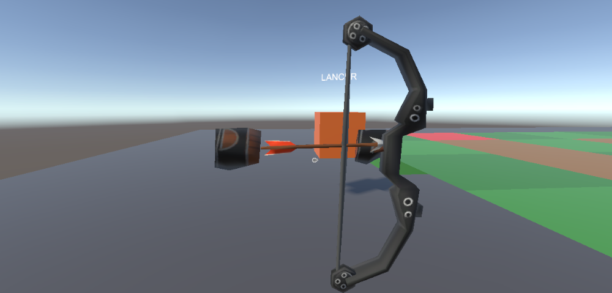
  - **l'arc cache la vue dans le simulateur** : le simulateur tient les manettes à 30 cm du visage. Au casque, le bras est tendu (60-70 cm), l'arc est donc plus loin et plus petit à l'écran. À vérifier au casque avant de le réduire encore.

**Captures** (bibliothèque avec les singes 3D et leur aura, et singe tenu en main) :

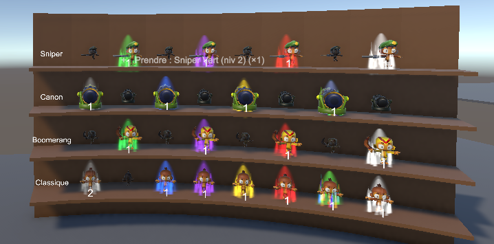

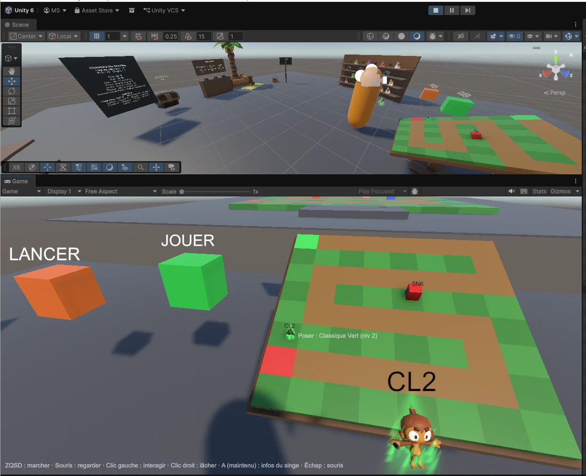

- **À vérifier au casque :** les fps avec beaucoup d'auras allumées (≤ 80 particules par singe, seulement sur les cases possédées).
- **Attention (équipe) :** ça touche des scripts de Dylan (`Visuals`, `LibrarySlot`, `ChestReward`, `PlacementSurface`, `Board`, `TowerManager`, `PlayerController`, `PrototypeGenerator`) et sa scène `Jeu.unity`.
- **Rangé :** changements parasites d'Unity annulés (`Jeu.unity`, réglages URP, réécrits à l'ouverture du projet) ; le package MCP for Unity reste installé sur mon PC seulement (non commité).
- **Bloque : le hub « sans bouger » n'est pas adapté à la VR.** Depuis le centre, tout est à 2,5-4 m : les boutons (JOUER, LANCER, Vider, améliorations), les 56 cases de la bibliothèque et le plateau sont **hors de portée des mains**. Au casque, il faudrait viser de loin avec un rayon pour tout, ce qui ressemble à un jeu à la souris (« test de l'écran » raté) et va contre la règle « tout à portée de bras ». Les 56 cases (7 types × 8 raretés) prennent aussi trop de place pour tenir près du joueur.

  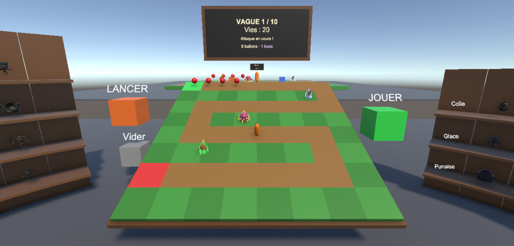

  **Pistes** (à décider en équipe) :
  1. **Réagencer, sans changer le jeu** : un établi en arc de cercle à portée de bras (~0,6 m) avec le plateau incliné au milieu et de vrais boutons à enfoncer sur le bord ; le coffre et le bananier derrière, en se retournant (snap turn). Limite : les 56 cases ne tiennent toujours pas à portée.
  2. **Changer la bibliothèque** : elle n'affiche plus 56 cases fixes. Une étagère tournante (carrousel) à portée de main, 7 compartiments (un par type) qu'on fait tourner à la main ; chaque compartiment montre seulement les raretés qu'on possède. Geste VR en plus (tourner), et beaucoup moins de place.
  3. **Inventaire sur la main** (comme le sac de Half-Life Alyx ou la ceinture de Job Simulator) : on ouvre un menu sur le poignet et on y attrape directement le singe. Le plus compact, mais c'est un vrai changement de fonctionnement et plus de travail.
  4. **Garder la disposition et viser au rayon** (Ray Interactor, support 5) : le moins de travail, mais le moins « VR ».

  **Mon avis (proposé par Claude) :** 1 + 2 ensemble. L'établi pour le plateau et les boutons, le carrousel pour les singes. Le rayon seulement pour ce qui reste loin (prendre une banane au sol, par exemple).
- **Fait : pistes 1 + 2 retenues et prototypées** (sur ma branche, scène régénérée) : **tout est à portée de main** autour du joueur, qui reste au centre :
  - **devant, l'établi** : le plateau incliné à 30°, le bord le plus proche à 0,45 m (1,4 m de côté) ; JOUER, LANCER et Vider sont des boutons sur des socles à hauteur de main (0,7 m du joueur) ; le tableau de la vague est plus loin, seulement à lire ;
  - **sur les côtés, deux étagères tournantes** (nouveau script `Hub/Carousel.cs`) : un meuble carré par côté, une face par type de singe, 8 cases par face ; la face avant est à 0,7 m. On clique sur la manivelle jaune du dessus pour faire un quart de tour (au casque : la tourner à la main) ;
  - **derrière** : le coffre et le panneau d'amélioration à gauche ; à droite le bananier, dont les bananes tombent maintenant **sur une table à hauteur de main** qui vient jusqu'au joueur (plus de ramassage au sol), avec le panier juste à côté ;
  - les textes du coffre (consigne, roulette, chances, prix) et des boutons sont réduits, sinon ils prenaient tout l'écran de près.
  Testé en Play : l'étagère tourne, les bananes se posent sur la table près du panier, le coffre s'ouvre depuis le centre, aucune erreur.

  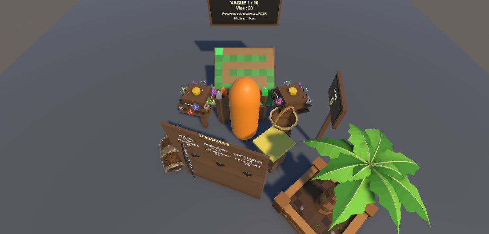

  **Reste à faire pour la VR :** de vrais gestes au casque (enfoncer les boutons, tourner la manivelle, prendre un singe ou une banane à la main avec XR Grab), et vérifier les tailles au casque.
- **Annulé :** après l'avoir essayé, **ça faisait surchargé** (tout entassé autour du joueur, on ne voyait plus rien clairement), donc je reviens à la version d'avant (le hub « sans bouger » sur un grand cercle, avec la bibliothèque courbe). L'établi, les étagères tournantes et la table des bananes sont retirés (`Carousel.cs` supprimé, générateur et scène `Jeu.unity` remis comme avant). Le problème VR noté plus haut reste donc ouvert.

### IA
| Outil | Pour quoi | Gardé / jeté |
|---|---|---|
| Claude (Code) | Mains inclinées (pouce relevé), arc tenu sur le côté de la main gauche, main droite collée à la corde pendant la tension ; testé en Play | À tester au casque |
| Claude (Code) | Mains tournées dos vers le haut, plus petites, doigts repliés vers la paume | Gardé |
| Claude (Code) | Tir VR utilisable dans le simulateur (tension au temps sans casque, geste de la main avec casque), mains qui se ferment davantage | À tester au casque |
| Claude (Code) | Retour à la main simple de Quincy, fermeture corrigée (bon axe, pliage léger) ; singe tenu devant la main gardé | À tester au casque |
| Claude (Code) | Nouvelles mains de Quincy modélisées et riggées par script Blender (2 phalanges par doigt), pliage phalange par phalange, singe tenu devant la main ; testé en Play | Mains jetées (pas dans le style), singe devant la main gardé |
| Claude (Code) | Corrections après test : arc plus petit, corde plus facile à attraper (40 cm, grip ou gâchette) ; mains de Quincy riggées (poignet, paume, doigts, pouce) à la place des manettes, qui se ferment avec les boutons ; testé en Play | Arc gardé, mains jetées (refaites) |
| Claude (Code) | Système de l'arc : arc seulement sur la carte, tir au casque (main droite sur la corde) et au PC (clic droit), corde et branches animées, flèche qui vole et éclate les ballons ; prefabs, générateur, testé en Play | À tester au casque |
| Claude (Code) | Séparation de l'arc de Quincy par un script Blender (sur une copie) : arc à part avec son squelette (poignée, branches, corde à tirer), os de la flèche en points d'accroche, point `BowGrip` dans la main, export FBX, matériau ; testé dans Unity | À tester au casque |
| Claude (Code) | Analyse du rig de Quincy dans Unity puis dans Blender en lecture seule (squelette, poids, séparation arc / bras / mains) et liste de ce qu'il faut corriger dans Blender pour utiliser l'arc comme arme | Gardé |
| Claude (Code) | Réécriture de mes prompts du jour, plus clairs et mieux structurés (contexte, objectif, contraintes), sans changer leur sens | Gardé |
| Claude (Code) | Retour à la version d'avant (hub « sans bouger » sur un grand cercle) : générateur et scène remis, `Carousel.cs` supprimé | Gardé |
| Claude (Code) | Prototype des pistes 1 + 2 : établi à portée de main (plateau, boutons sur socles), deux étagères tournantes (`Carousel`), table des bananes à hauteur de main, textes du coffre réduits ; scène régénérée et testée en Play | Jeté (trop surchargé, annulé après essai) |
| Claude (Code) | Analyse du problème VR du hub « sans bouger » (portée des boutons et de la bibliothèque) et 4 pistes de solution, capture ajoutée | À décider en équipe |
| Claude (Cowork) | Tronc du bananier rallongé ×3 avec un script Blender, export FBX | Gardé (intégré sur `feat/prototype-maxens`) |
| Claude (Code) | Test du hub « sans bouger » d'après mon schéma : joueur fixé au centre, tout rapproché en rond, plateau agrandi, zone de chute vers le joueur, portée 6 m, plus de textes au-dessus des singes ; scène régénérée et testée en Play | À tester au casque |
| Claude (Code) | Lecture des PDF du cours (installation de `pypdf`), relecture du code avec le guide : aura en prefab réglable dans l'Inspector, renderers gardés en mémoire, constantes nommées, aura blanche corrigée | À tester au casque |
| Claude (Code) | Corrections après mon test : singe 3D aussi en miniature sur le plateau, aura élargie pour le Canon et le Tireur, Canon retourné, menu pour mettre les singes 3D dans la scène hors Play (scène `Jeu.unity` enregistrée, 1,5 Mo) ; testé en Play et hors Play, aucune erreur | À tester au casque |
| Claude (Code) | Modèles 3D des singes dans la bibliothèque (et coffre, main, carte) + aura « Dragon Ball » en particules à la couleur de la rareté, outil d'éditeur pour brancher les modèles, testé en Play via Unity MCP | À tester au casque |
| Claude (Code) | Copie de tous mes modèles (FBX, GLB, textures) dans `_Project/Art/`, bananier grand tronc à la place de l'ancien | Gardé |
| Claude (Code) | Mise à jour de `main`, création et push de la branche de test `feat/prototype-maxens`, journal et prompt | Gardé |

## Lun. 5 oct. 2026
- **Fait :** prototype du **bananier** (branche `feat/proto-bananier`), testé à la souris dans l'éditeur :
  - le bananier fait tomber des bananes à intervalle régulier, avec un petit « boing » de l'arbre ;
  - 3 stats améliorables : fréquence, pourriture, valeur (niveaux et prix déjà calculés, pas encore payés) ;
  - les bananes brunissent puis pourrissent : une banane pourrie ne vaut plus rien et disparaît ;
  - le panier compte l'argent des bananes déposées dedans ;
  - le récolteur automatique (le futur singe récolteur) est volontairement limité : 1 banane toutes les 6 s, et il garde 40 % ;
  - menu `Bananes > Installer / Créer une scène de test` qui monte tout seul le système.
- **Corrigé dans la journée :**
  - on ne voyait pas les bananes tomber, elles atterrissaient **dans le socle** du bananier. Elles tombent maintenant en dehors du bac, du côté du panier ;
  - au début, les bananes **n'étaient pas portées** : un clic et elles disparaissaient direct dans le panier. Maintenant, clic maintenu = banane en main, on la glisse au-dessus du panier et on relâche (même logique `Prise()` / `Lachee()` qu'en VR).
- **Bloque :** pas encore de packages XR dans ce projet (XR Interaction Toolkit + OpenXR), donc pas encore testé au casque. Point de confort à garder en tête : le support classe « ramasser des objets au sol en boucle » dans les choses à éviter. Pistes : attraper en l'air, panier et bananes sur une table, ou ramassage à distance.
- **Demain :** installer XRI + OpenXR, tester la prise de banane au casque.

**Captures du prototype bananier** (souris, éditeur) :

Le bananier et le panier au lancement.

Les bananes tombent à côté du bac, du côté du panier, et on les prend pour les mettre dedans.

**Rangement** (comme le reste du projet) : `Unity/Assets/_Project/` → `Art/Bananier` (FBX, textures, matériaux), `Prefabs/Banane.prefab`, `Scripts/Runtime` et `Scripts/Editor`, scène de test dans `Scenes/Sandbox/Maxens/BananierSandbox.unity`. Projet en Unity 6000.3.8f1, URP.

**Mes retours sur les prototypes des autres** _(mon avis, 18h17)_

- **Dylan (hub, plateau, bibliothèque)** :
  - Je n'aime pas trop les textes au-dessus de chaque cube. Ce n'est pas essentiel et ça rend l'ensemble moins lisible (peut-être temporaire ?).
  - Le plateau devrait être vraiment plus grand : c'est l'élément principal.
  - Il faut trouver une autre idée pour les bibliothèques : elles ne sont pas très lisibles et prennent trop de place. Je n'ai pas encore d'idée, on en parle demain.
  - Sinon, tout est bon, j'aime bien la mécanique.
- **Nicolas (coffres)** :
  - J'aime bien, mais je ne sais pas si je ne préférerais pas l'idée de départ : un bruit, le singe qui sort du coffre et qui tourne, avec l'aura qui apparaît.
  - Si on garde la version actuelle, c'est pas mal. Il faudrait juste que le coffre se tourne automatiquement vers le joueur.
- **Moi (bananier)** : rien à redire.

### IA
| Outil | Pour quoi | Gardé / jeté |
|---|---|---|
| Claude (à confirmer) | Scripts du bananier : Bananier (production + stats améliorables), Banane (chute, pourriture), Panier (compte l'argent), Récolteur, installeur automatique dans l'éditeur | Gardé |
| Claude (Cowork) | Vérification du projet avant push (compilation, références des prefabs et de la scène, .meta) et liste de ce qui manque pour la VR | Gardé |
| Claude (Cowork) | Test souris : banane tenue en main (clic maintenu) au lieu de disparaître au clic | Gardé |
| Claude (Cowork) | Rangement dans `_Project/` comme le reste du dépôt, branche, journal et captures pour le push | Gardé |
