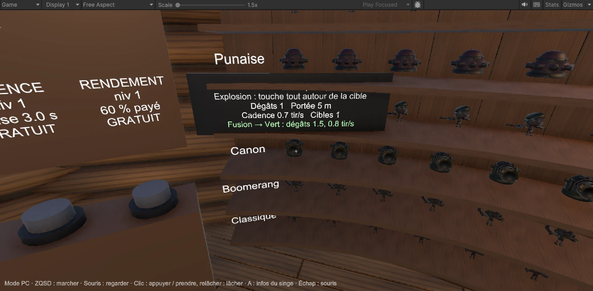
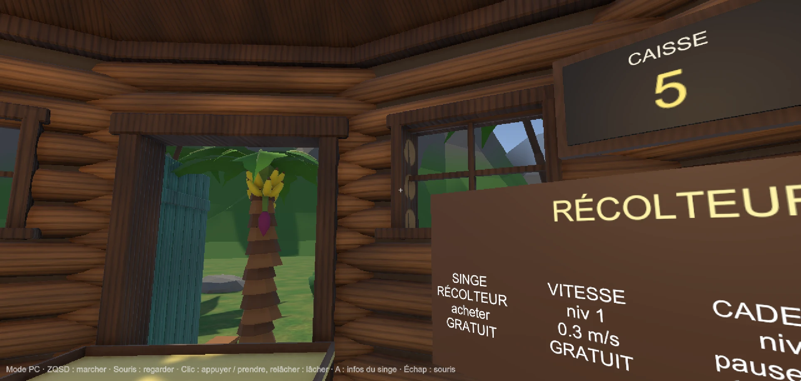

# Journal de bord — Nicolas

_Entrée la plus récente en haut. Une entrée par jour travaillé. Toute aide de l'IA est notée ici (outil, pour quoi, gardé/jeté)._

## Mer. 7 oct. 2026
**Mon analyse critique du jeu** _(transmise par Dylan, qui corrige sur la branche `fix-all` ; mise en forme par l'IA)_
1. **Bibliothèque :** le texte « Bibliothèque » suit la caméra au lieu de rester fixe.
2. **Singe récolteur :** par moments, il a un bug de collision avec la table du panier et passe à travers son bord gauche.
3. **Fiche du singe (touche A) :** la commode (la bibliothèque) cache les informations. Il faudrait un genre de « z-index » pour que la fiche passe devant (photo 1).
4. **Textures qui se chevauchent :** selon l'angle de vue, une texture passe par-dessus une autre ; par exemple, les bûches du mur débordent un peu sur la fenêtre (photo 2).
5. **Herbe de la carte :** en mode FPS, hors du hub, la texture de l'herbe est très moche.
6. **Chute dans le vide :** en mode FPS, si on s'aventure trop loin, on traverse le sol et on tombe sans être remis en place : on est bloqué. Il faudrait revenir au hub, ou à une position proche d'avant la chute.
7. **Bouton LANCER :** après avoir lancé la vague puis être revenu au hub, le bouton n'a pas changé, ce qui donne envie de recliquer dessus. Le griser une fois la vague lancée éviterait ça.
8. **Singes tenus en main :** ils sont encore en T-pose ; il faudrait changer leur design.
9. **Arc :** l'arc et son animation de tir ne rendent pas très bien, en mode PC comme en VR.
10. **Plateau 3D :** quand on pose un singe, on ne voit pas sa portée, ni un rappel de ses dégâts, de ses tirs par seconde, etc.

_Note : les deux photos ont été prises avant les corrections de Dylan sur `fix-all` (anciennes polices, ancien comptoir), donc le point 1 est peut-être déjà réglé._

## Lun. 5 oct. 2026
- **Fait :** création du projet Unity (6000.3.8f1, URP) dans `Unity/` et du prototype « ouverture de coffres » (money, 7 raretés, probabilités, roulette façon CS, animation du coffre).
- **Bloque :** projet pas encore ouvert dans Unity : il reste à installer les packages (menu SAE501 > 1) puis créer la scène (menu SAE501 > 2) et tester.
- **Demain :** tester le proto à l'écran, régler les probabilités, valider avec Dylan et Maxens.

### IA
| Outil | Pour quoi | Gardé / jeté |
|---|---|---|
| Claude Code | Squelette du projet Unity (réglages URP copiés du template Unity 6, manifest des packages) | Gardé |
| Claude Code | Scripts C# du coffre : `Wallet`, `ChestOdds` (probabilités + gel à 10 coffres), `ChestController`, `RouletteView` (roulette façon CS), `DesktopInteractor`, `ChestDebugPanel` | Gardé (à relire et tester) |
| Claude Code | Script Editor `Sae501SetupMenu` : installation des packages et création de la scène de test en un clic | Gardé (à tester) |
| Claude Code | Ajout de `*.glb` aux fichiers Git LFS (`.gitattributes`) | Gardé |
| Claude Code | Retouches UI : sol 30 m, joueur (ZQSD + souris, bonhomme basique), texte « [E] Ouvrir le coffre » qui suit la caméra, roulette qui n'apparaît qu'à l'ouverture et disparaît 3 s après le résultat, menu bêta caché (F1). Scripts `PlayerController`, `Billboard`, `ChestPrompt`, retouche de `ChestController`, `RouletteView`, `DesktopInteractor`, `ChestDebugPanel` | Gardé (à tester) |
| Claude Code | Corrections : le coffre se referme (animation à l'envers) quand la roulette disparaît ; probabilités qui changent à chaque ouverture (1er coffre limité à Bleu, ensuite toutes raretés, LGBT qui monte jusqu'au gel à 10) ; suppression des paliers manuels et du bouton « Palier suivant » | Gardé (à tester) |
| Claude Code | Déblocage progressif des raretés (Violet au coffre 2, Jaune au 4, Rouge au 6, LGBT au 8) avec montée en puissance sur 3 coffres, LGBT jusqu'au gel à 10 ; remplace la limite « 1er coffre = Bleu max » | Gardé (à tester) |
